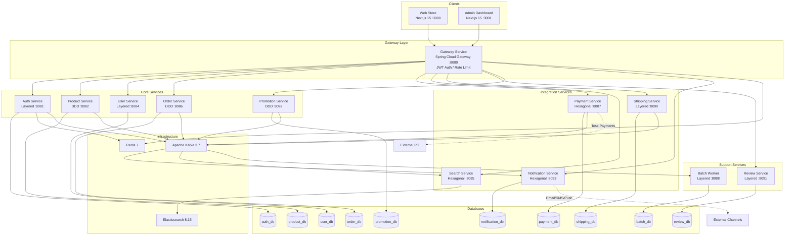
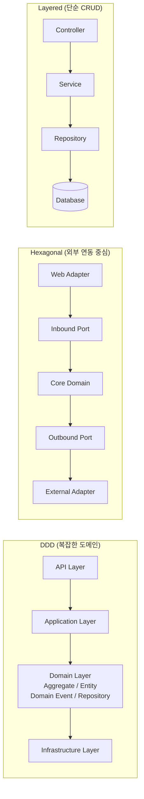
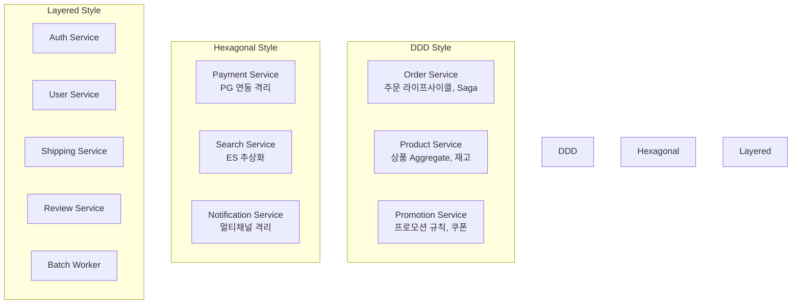
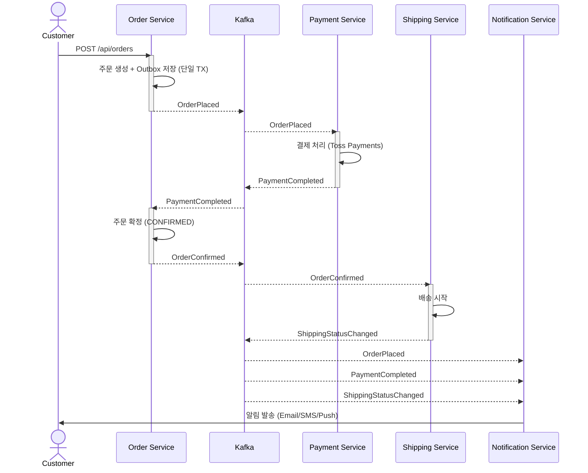
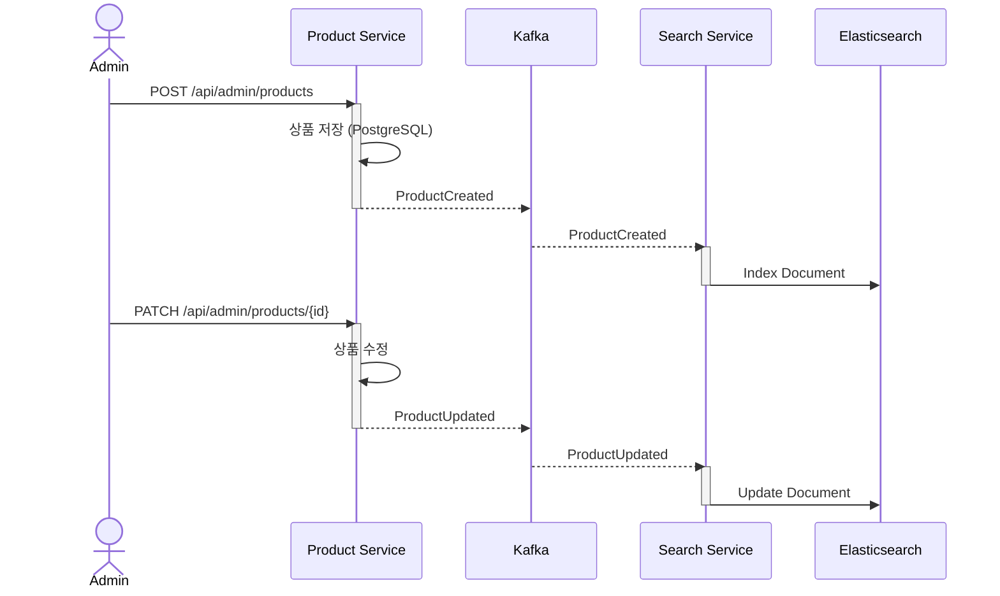
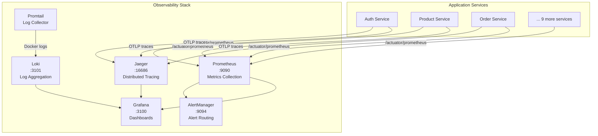
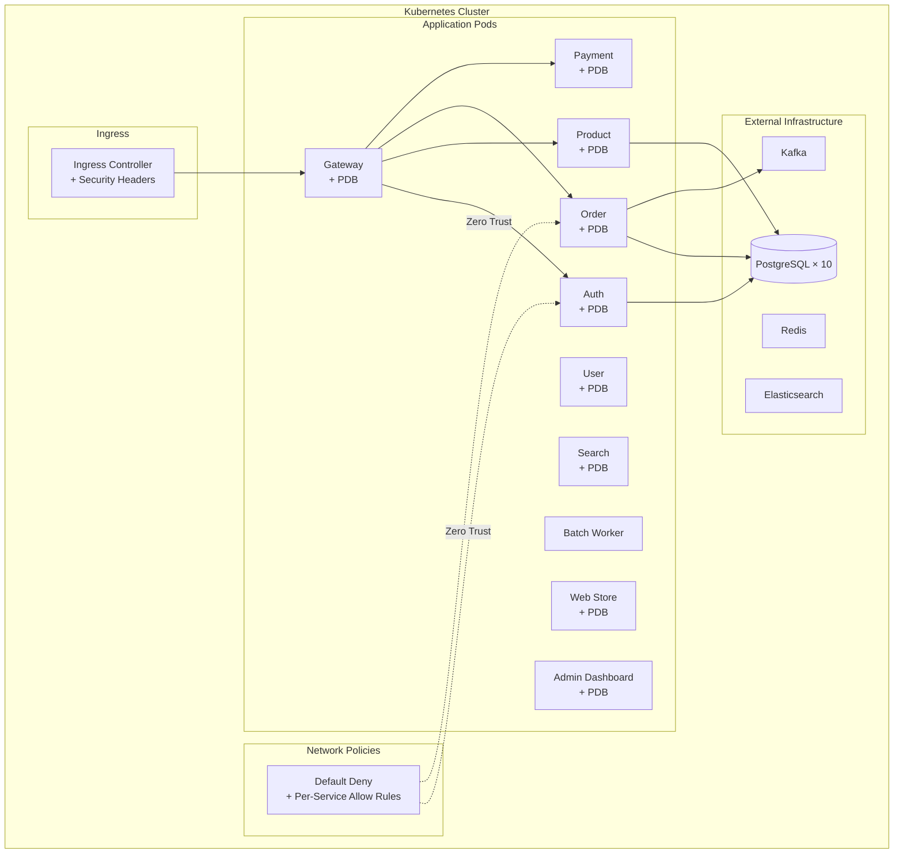
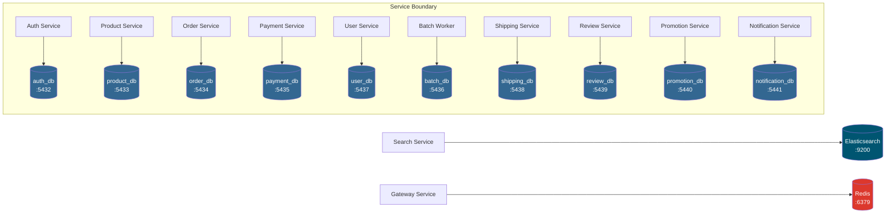

# Architecture Diagrams

이 문서는 시스템의 전체 아키텍처를 Mermaid 다이어그램으로 시각화합니다.

---

## 1. System Overview

전체 서비스 토폴로지와 통신 흐름입니다.

---

## 2. Service Architecture Patterns

서비스 복잡도에 따라 3가지 아키텍처 패턴을 선택 적용합니다.

### 패턴 적용 매핑

---

## 3. Event Flow: Order Saga

주문 생성부터 배송까지의 이벤트 기반 Saga 흐름입니다.

---

## 4. Event Flow: Product Search Indexing

상품 변경 이벤트가 검색 인덱스에 반영되는 흐름입니다.

---

## 5. Infrastructure & Observability

---

## 6. Kubernetes Deployment Topology

---

## 7. Database-per-Service

