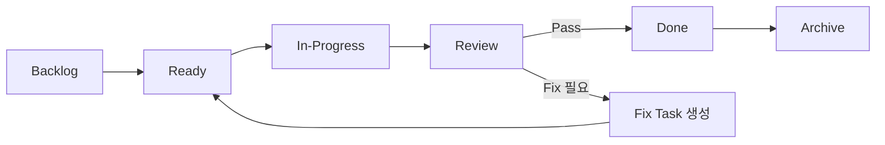
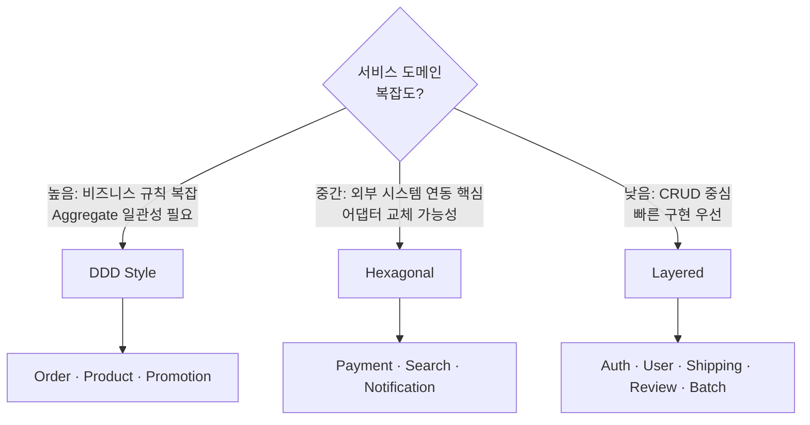

# Development Process & Technical Highlights

이 문서는 프로젝트의 개발 방법론과 기술적 차별점을 설명합니다.

---

## Spec-Driven Development

코드 작성 전에 반드시 스펙을 먼저 정의합니다.

```
specs/
├── contracts/          # API & Event 계약 (11 HTTP + 8 Event)
│   ├── http/           # REST API 계약서
│   └── events/         # 도메인 이벤트 계약서
├── services/           # 서비스별 아키텍처 정의
├── features/           # 기능 스펙 (6개)
├── use-cases/          # 유스케이스 (6개)
├── rules/              # Taxonomy 기반 규칙
└── platform/           # 플랫폼 공통 규칙
```

### 왜 Spec-First인가?

- **계약이 구현보다 먼저** — API/Event 계약을 정의한 후 서비스를 구현합니다. 계약 변경 없이는 인터페이스를 바꿀 수 없습니다.
- **스펙이 코드의 Source of Truth** — 스펙과 코드가 충돌하면 스펙이 우선합니다.
- **서비스 독립 개발 가능** — 계약만 합의되면 각 서비스를 병렬로 개발할 수 있습니다.

---

## Task-Driven Workflow

모든 구현은 태스크를 통해 관리됩니다.

```
backlog → ready → in-progress → review → done → archive
```

### 태스크 필수 섹션

모든 태스크는 다음 섹션이 있어야 구현 가능합니다:

- **Goal** — 무엇을 달성하는가
- **Scope** — 변경 범위
- **Acceptance Criteria** — 완료 조건
- **Related Specs** — 참조 스펙
- **Related Contracts** — 관련 API/Event 계약
- **Edge Cases** — 예외 상황
- **Failure Scenarios** — 실패 시나리오

### 태스크 워크플로우



---

## Taxonomy-Based Rule System

프로젝트의 도메인과 특성(trait)을 선언하면, 적용할 개발 규칙이 자동으로 결정됩니다.

### 작동 원리

```yaml
# PROJECT.md
domain: ecommerce
traits: [transactional, content-heavy, read-heavy, integration-heavy]
```

이 선언에 따라 규칙이 레이어별로 로딩됩니다:

```
1. specs/rules/common.md              ← 항상 적용
2. specs/rules/domains/ecommerce.md   ← domain이 ecommerce일 때
3. specs/rules/traits/transactional.md ← trait에 transactional 포함 시
4. specs/rules/traits/content-heavy.md
5. specs/rules/traits/read-heavy.md
6. specs/rules/traits/integration-heavy.md
```

### Trait별 활성화되는 규칙

| Trait | 활성화되는 패턴 |
|-------|----------------|
| **transactional** | Saga Pattern, Idempotency Key, Outbox Pattern, 분산 트랜잭션 |
| **content-heavy** | 캐시 전략, CDN, 검색 인덱싱, 미디어 처리 |
| **read-heavy** | 읽기 복제, 페이지네이션 최적화, 캐시 우선 |
| **integration-heavy** | Circuit Breaker, Retry + Backoff, DLQ, Idempotent Side-effect |

### 이 시스템의 가치

- **새 프로젝트에 즉시 적용** — domain과 traits만 선언하면 규칙이 자동 결정
- **규칙의 재사용** — 동일 trait를 가진 프로젝트는 동일 규칙 적용
- **명시적 Override** — 규칙 예외는 반드시 문서화해야 함

---

## Architecture Decision Per Service

전역 아키텍처를 강제하지 않고, 각 서비스의 도메인 복잡도에 맞는 패턴을 선택합니다.

### 선택 기준



### 각 패턴의 실제 적용

**DDD (Order Service 예시)**
- Aggregate Root: `Order`
- Value Objects: `OrderItem`, `ShippingAddress`
- Domain Events: `OrderPlaced`, `OrderConfirmed`, `OrderCancelled`
- Repository Interface는 Domain Layer에 정의, Infrastructure에서 구현

**Hexagonal (Payment Service 예시)**
- Inbound Port: `PaymentUseCase`
- Outbound Port: `PaymentGatewayPort`
- Adapter: `TossPaymentAdapter` (Toss Payments 구현)
- 핵심 이점: PG사 교체 시 Adapter만 변경

**Layered (Auth Service 예시)**
- Controller → Service → Repository
- 단순 CRUD + JWT 발급 로직
- 복잡도가 낮아 과도한 추상화 불필요

---

## Key Technical Decisions

### 1. Database-per-Service

각 서비스가 독립 데이터베이스를 소유합니다 (PostgreSQL 16 × 10개).

- 서비스 간 DB 직접 접근 금지
- 데이터 조회는 API 또는 Event 기반
- 스키마 마이그레이션: Flyway

### 2. Outbox Pattern for Event Reliability

DB 트랜잭션과 Kafka 메시지 발행의 원자성을 보장합니다.

```
1. 비즈니스 로직 + Outbox 테이블 INSERT (단일 트랜잭션)
2. Relay가 Outbox 테이블 폴링 → Kafka 발행
3. 발행 성공 시 Outbox 레코드 처리 완료 표시
```

적용 서비스: Order, Shipping, Promotion (java-messaging 라이브러리로 공통화)

### 3. Monorepo with Polyglot Build

```
Gradle (Java 서비스 12개 + 공유 라이브러리 6개)
  +
pnpm Workspaces (프론트엔드 2개 + 공유 패키지 5개)
  +
Turbo (프론트엔드 빌드 오케스트레이션)
```

- 코드 공유와 독립 배포를 동시에 달성
- 변경 감지 기반 CI로 불필요한 빌드 방지

### 4. Comprehensive Observability

| 관심사 | 도구 | 수집 방식 |
|--------|------|----------|
| Metrics | Prometheus + Grafana | `/actuator/prometheus` (15s 스크래핑) |
| Logs | Loki + Promtail | Docker 컨테이너 로그 수집 |
| Traces | Jaeger + OpenTelemetry | OTLP (서비스 내 자동 계측) |
| Alerts | AlertManager | Prometheus 규칙 기반 |

### 5. Zero Trust Network (K8s)

```yaml
# Default: 모든 트래픽 차단
kind: NetworkPolicy
spec:
  podSelector: {}
  policyTypes: [Ingress, Egress]

# 서비스별: 필요한 통신만 명시적 허용
# e.g., order-service → kafka, order-db만 허용
```

---

## Testing Strategy

### 테스트 피라미드

```
        ┌───────────┐
        │  Load (k6) │  E2E 시나리오, 성능 SLA
        ├───────────┤
        │ Contract   │  API/Event 계약 검증
        ├───────────┤
        │Integration │  Testcontainers (실제 DB/Kafka)
        ├───────────┤
        │   Unit     │  JUnit 5, Vitest
        └───────────┘
```

### 성능 SLA (k6 Load Test)

| Metric | Target |
|--------|--------|
| P95 Response Time | < 500ms |
| P99 Response Time | < 1,000ms |
| Error Rate | ≤ 1% |
| Min Throughput | 10 req/s per endpoint |

---

## Commit Convention

```
<type>(<scope>): <description>

Types: feat, fix, refactor, docs, chore, test
Scope: service name or platform area
```

실제 커밋 예시:
```
feat(platform): 분류(taxonomy) 기반 규칙 시스템 v0.1 도입
fix(web-store): product API mock 폴백 제거로 non-UUID id 유출 경로 차단
refactor(auth-service): ClientIpResolver 패키지 이동, JwtProperties 초기화 버그 수정
```
