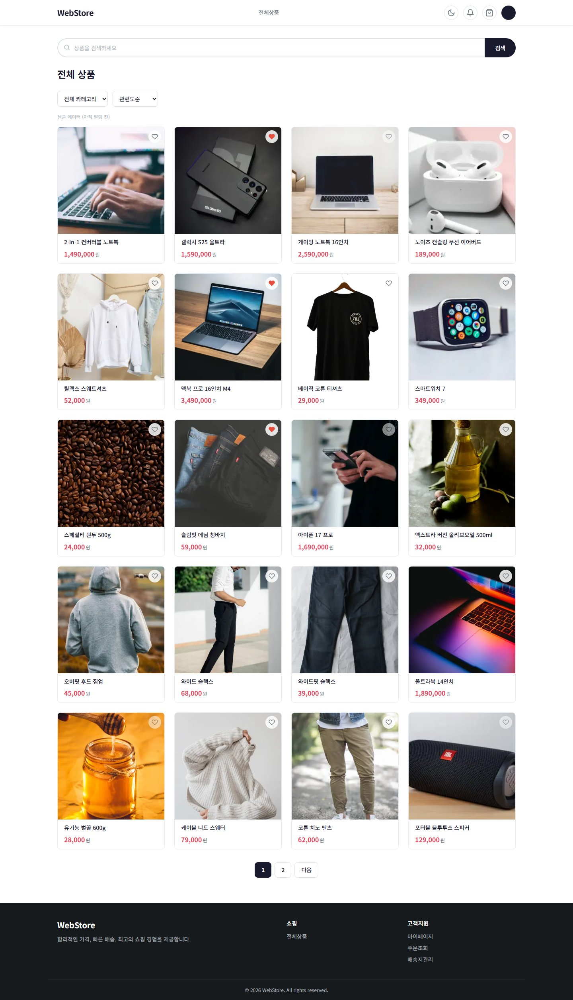
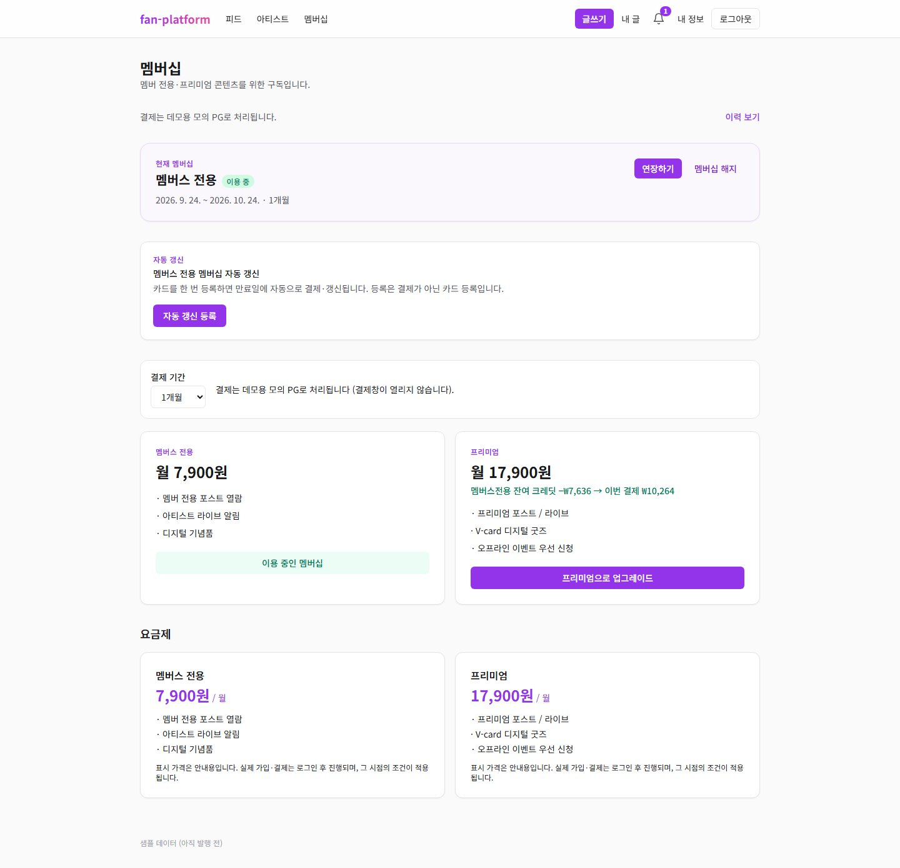
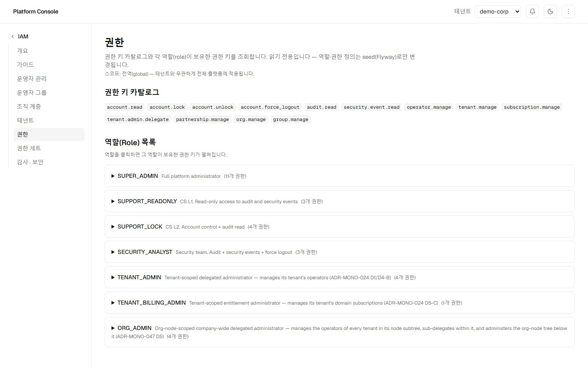
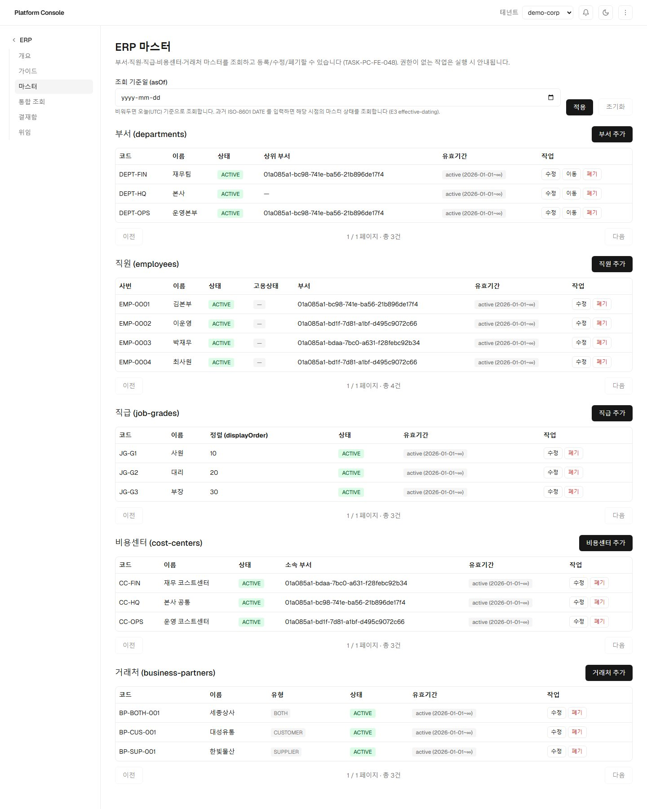
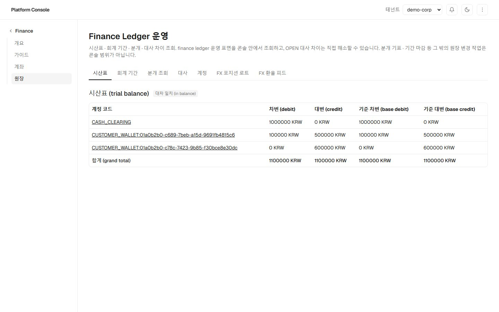

# 포트폴리오 — 8개 서비스로 이루어진 하나의 플랫폼

> **이 문서는 아무것도 실행하지 않고 5분만 쓰는 사람을 위한 것입니다.**
> 클론도, 설치도, 로그인도 필요 없습니다. 스크롤만 하면 됩니다.
>
> 개발자용 안내는 따로 있습니다 — [로컬 개발 시작하기](../README.md#️-getting-started) ·
> [면접 데모 워크스루](guides/interview-demo-walkthrough.md) · [개발 프로세스](guides/development-process.md).

---

## 한 문단으로

**여덟 개를 따로 만든 것이 아니라, 한 회사가 실제로 굴리는 시스템을 조각낸 것입니다.**
고객은 스토어에서 주문하고(ecommerce), 그 주문은 창고로 흘러가 피킹·출고되며(wms), 재고가
떨어지면 보충 계획이 서고 발주가 나갑니다(scm). 돈은 복식부기 원장에 남고(finance), 사람과
조직·결재는 ERP 가 들고(erp), **누가 무엇을 할 수 있는가는 한 곳에서만 정해집니다**(iam).
운영자는 도메인마다 다른 화면을 갈아타지 않고 **통합 콘솔 하나**로 여섯을 다룹니다
(platform-console). 팬 플랫폼은 같은 뼈대 위에 **전혀 다른 도메인**(멤버십 구독·게이팅된
콘텐츠)을 올려 본 것입니다 — 규칙과 공용 라이브러리가 도메인에 안 묶여 있다는 증거입니다.

🔵 서비스 사이는 **이벤트**로 잇습니다. 주문 → 출고는 saga 로 조율하고, 발행은 outbox 를
거칩니다. 그래서 한 서비스가 잠깐 죽어도 다른 쪽이 같이 죽지 않습니다.

---

## 지금 열리는 데모

**[hubwang.com](https://hubwang.com)** — 세 화면은 **로그인 없이 지금 바로** 둘러볼 수
있습니다. 서버를 안 켜도 됩니다.

> 🔴 **글쓰기·주문·운영 같은 실시간 기능은 백엔드가 필요하고, 켜는 데 약 10분 걸립니다.**
> (2026-09-09 실측: 콜드 9분 14초 · 웜 9분 16초. 비용 때문에 평소엔 꺼 두고, 20분간 활동이
> 없으면 자동으로 종료됩니다.) 그 10분을 **모르면 고장으로 읽히기 때문에** 여기 적습니다.

| | 로그인 없이 | 로그인 후 |
|---|---|---|
| [스토어](https://store.hubwang.com) | 상품 목록·상세·검색·카테고리·정렬 | 장바구니 · 주문 · 결제 · 마이페이지 |
| [팬 플랫폼](https://fan.hubwang.com) | 공개 피드 · 아티스트 · 멤버십 소개 | 글쓰기 · 댓글 · 팔로우 · 멤버십 가입 |
| [운영자 콘솔](https://console.hubwang.com) | 샘플 데이터 둘러보기 | 6개 도메인 운영 · IAM · 감사 로그 |

**[알려진 한계는 숨기지 않고 전부 적어 두었습니다](guides/interview-demo-walkthrough.md#6-알려진-한계-조용한-누락-없이)**
— 설계상 그런 것과 아직 못 고친 것을 갈라서.

---

## 서비스

> 🔵 아래 화면 중 **운영자 콘솔이 그리는 것**은 그렇게 밝혀 두었습니다. wms·scm·finance·erp 는
> 자체 UI 가 없고 **API 입니다** — 콘솔이 그 여섯을 한 화면에서 다룹니다(Model B).

### 이커머스 — [`projects/ecommerce-microservices-platform`](../projects/ecommerce-microservices-platform/)

백엔드 **12개 마이크로서비스** + Next.js 스토어프런트. saga 오케스트레이션 · outbox ·
Elasticsearch 상품 검색 · MinIO 업로드 · 셀러 정산.

   
  <em>스토어 — 카테고리·정렬 필터, 검색, 위시리스트 토글, 페이지네이션</em>

### 팬 플랫폼 — [`projects/fan-platform`](../projects/fan-platform/)

백엔드 **5개** + Next.js. 구독 상태 기계 · PG 모의 연동 · outbox · 멤버십 이벤트를 받아
쌓는 알림 인박스.

   
  <em>멤버십 — 업그레이드가 <strong>잔여 크레딧을 일할로 정산</strong>해 이번 결제액을 다시 계산한다</em>

### IAM — [`projects/iam-platform`](../projects/iam-platform/)

**모노레포 전체의 OIDC IdP.** Spring Authorization Server 기반. PKCE public client ·
refresh token rotation · revoke · 멀티테넌트 행 단위 격리 · RFC 8693 assume-tenant 토큰 교환.
**모든 프로젝트가 여기에 붙습니다.**

   
  <em>운영자 콘솔 — 권한 키 카탈로그와 역할별 보유 권한. 역할 정의는 seed 로만 바뀌는 읽기 전용이다</em>

### ERP — [`projects/erp-platform`](../projects/erp-platform/)

**4개 서비스**: 조직 마스터(부서·직원·직급·원가센터·거래처) · 다단계 결재와 위임 ·
조직도 read-model · 결재 인박스.

   
  <em>운영자 콘솔 — 마스터 5종. 행마다 <strong>유효기간</strong>이 붙고 <code>asOf</code> 로 과거 시점 상태를 조회한다</em>

### Finance — [`projects/finance-platform`](../projects/finance-platform/)

**2개 서비스**: 계좌(KYC · 가용/원장 잔액 · 홀드·해제·캡처 · 멱등 자금 이동) ·
원장(복식부기 · 시산표 · 회계 기간 · 대사).

   
  <em>운영자 콘솔 — 시산표. 차변·대변과 기준통화 환산이 나란히 서고 <strong>대차 일치</strong>를 화면이 직접 판정한다</em>

### WMS — [`projects/wms-platform`](../projects/wms-platform/)

**7개 서비스**: 마스터(5 애그리거트 + Lot 유효기간) · 재고(예약 · 출고 saga 컨슈머 4종 ·
저재고 알림) · 입고(ASN/검수/적치) · 출고(주문·피킹·패킹·배송 + saga 오케스트레이터) ·
알림 · 어드민(CQRS 읽기 측) · 게이트웨이. **이커머스 주문을 실제로 처리합니다.**

⚪ *대표 화면 없음 — 데모 시드에 창고 데이터가 아직 없어 화면이 비어 있습니다.
빈 표를 「제품」으로 보여주지 않기 위해 넣지 않았습니다.*

### SCM — [`projects/scm-platform`](../projects/scm-platform/)

**5개 서비스**: 조달(발주 생애주기 · 공급사 확인 · ASN 인테이크) · 재고 가시성(창고 스냅샷
위의 교차 노드 read-model) · 수요 계획(저재고 알림 소비 + 야간 스윕 → 보충 제안) · 물류 ·
게이트웨이.

⚪ *대표 화면 없음 — 위와 같은 이유입니다.*

### 운영자 콘솔 — [`projects/platform-console`](../projects/platform-console/)

`console-web`(테넌트 스위처 · 도메인별 운영 화면 · 결재 인박스 · 알림) +
`console-bff`(교차 도메인 집계). **wms·scm·finance·erp 의 유일한 프런트엔드입니다** —
위 화면들 중 「운영자 콘솔」이라 적힌 것이 전부 이 앱입니다.

⚪ *콘솔 자신의 화면(카탈로그·구독·파트너십)은 아직 고르지 않았습니다.*

---

## 어떻게 만들었나 — 규칙 주도 AI 협업

이 저장소는 **Claude Code 와 규칙 기반으로 함께 개발**하도록 짜여 있습니다. 요점은
「AI 에게 시켰다」가 아니라 **「AI 가 지킬 규칙을 저장소가 들고 있다」** 입니다.

- 프로젝트마다 `PROJECT.md` 가 `domain`·`traits` 를 선언하고, AI 는 거기 맞는 **규칙 레이어를
  자동으로** 읽습니다.
- [`CLAUDE.md`](../CLAUDE.md) 가 최소 운영 규칙을 정합니다 — **Hard Stop 조건**, 소스 오브
  트루스 우선순위, 태스크 생애주기.
- 스펙이 없거나 충돌하면 **우회 구현을 하지 않고 멈추고 보고합니다.**
- 작업은 `tasks/ready/` 에 있는 것만 착수하고 `ready → in-progress → review → done` 으로
  흐릅니다. `review`·`done` 은 얼어 있습니다.
- 🔵 **판정은 문서가 아니라 가드가 합니다.** `scripts/` 의 검사기들이 CI 에서 돌며 문서와
  코드가 어긋나는 순간 빨개집니다 — 이 문서의 이미지 배선도 그중 하나가 지킵니다.

**전체 과정**: [개발 프로세스 워크스루](guides/development-process.md)

---

## 저장소

**[github.com/kanggle/monorepo-lab](https://github.com/kanggle/monorepo-lab)** — 이것이
**살아 있는 저장소**입니다. 전체 개발 이력과 공용 라이브러리가 여기 있습니다.

각 프로젝트는 [`scripts/sync-portfolio.sh`](../scripts/sync-portfolio.sh) 로 독립 리포에
추출됩니다. 🔵 **위 링크는 전부 모노레포 안의 경로를 가리킵니다** — 사본은 추출본이고,
이력·공용 라이브러리·이 문서가 모두 여기 있기 때문입니다.

사본을 보고 싶으면 (**최종 동기화 2026-09-10 UTC 기준**):

| 사본 | 마지막 동기화 |
|---|---|
| [scm](https://github.com/kanggle/scm-platform) · [erp](https://github.com/kanggle/erp-platform) · [finance](https://github.com/kanggle/finance-platform) | 🟢 **2026-09-10** — 최신입니다 |
| [wms](https://github.com/kanggle/wms-platform) · [iam](https://github.com/kanggle/iam-platform) · [ecommerce](https://github.com/kanggle/ecommerce-microservices-platform) · [fan](https://github.com/kanggle/fan-platform) | 🔴 **2026-08-04** — 그만큼 뒤처져 있습니다 |

🔴 뒤처진 넷은 **그 프로젝트가 멈춘 것이 아니라 추출을 안 돌린 것**입니다. 그 넷의 최신
상태는 위의 모노레포 링크에서 보실 수 있습니다.
