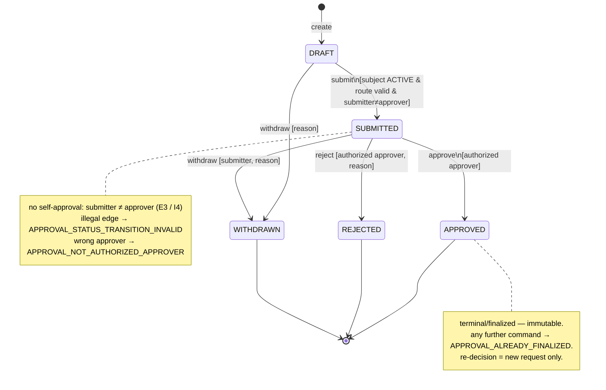

# approval-service — Architecture

This document declares the internal architecture of `erp-platform/apps/approval-service`.
All implementation tasks targeting this service must follow this declaration,
`platform/architecture-decision-rule.md`, and the rule files indexed by
`PROJECT.md`'s declared `domain` (`erp`) and `traits`
(`internal-system`, `transactional`, `audit-heavy`).

> **Provenance**: `approval-service` was **forward-declared as a v2 service** in
> [ADR-MONO-016](../../../../../docs/adr/ADR-MONO-016-erp-platform-bootstrap.md) § D3
> (the deferred候補 vs the v1 `masterdata-service`; deferred "after the rule
> library digests `internal-system` at smaller scope first"). `masterdata-service`
> (v1) and `read-model-service` (first increment, TASK-ERP-BE-007) have since shipped
> and exercised the `internal-system` + `transactional` + `audit-heavy` stack on the
> erp library. **This spec is the FIRST INCREMENT (v1.0) of `approval-service`** — it
> realises the already-recorded D3 forward-declaration as a constrained increment
> (single-stage route, the core `DRAFT → SUBMITTED → APPROVED|REJECTED|WITHDRAWN`
> state machine, no-self-approval, idempotent transitions, immutable audit) and does
> **not** reopen the ADR-016 § D3 decision — it executes it. This is the exact
> precedent set by `read-model-service`'s first-increment § D3 amendment pattern: an
> additive first increment of a forward-declared service introduces no new
> architecture decision (HARDSTOP-09 is satisfied by this `architecture.md`, authored
> **before** implementation). The full approval-service (multi-stage routing, 대결/위임,
> `IN_REVIEW`) stays v2-deferred — see § Out-of-Scope.

> **v2.0 AMENDMENT (TASK-ERP-BE-012 — multi-stage routing + `IN_REVIEW`; the
> SECOND increment of the same ADR-MONO-016 § D3 forward-declaration).** This
> increment realises the **multi-stage Approval Route (1~N stages)** and the
> **`IN_REVIEW` intermediate state** that `rules/domains/erp.md` Ubiquitous
> Language names (`DRAFT → SUBMITTED → (IN_REVIEW →) APPROVED`). It is **additive,
> backward-compatible, and authored before implementation** — like the v1.0
> first-increment, it **executes** the recorded § D3 forward-declaration and
> introduces **no new architecture decision** (HARDSTOP-09 satisfied here). The
> changes layered over the v1.0 sections below:
>
> - **`IN_REVIEW` status** (non-terminal) joins `ApprovalStatus`. `isFinalized()`
>   is unchanged (only APPROVED/REJECTED/WITHDRAWN are terminal).
> - **`ApprovalRoute` becomes an ordered list of 1~N stages** (each stage = one
>   `Approver` at a `stage_index`). The v1.0 `singleStage(...)` factory is retained
>   (= a 1-stage route); `multiStage(submitter, [approverId…])` is added.
>   Route-validity (`APPROVAL_ROUTE_INVALID`) extends: zero stages / a blank
>   approver / `submitter ∈ any stage` (self-approval) / a **duplicate approver
>   across stages** (`details.cause = "duplicate_stage_approver"` — Separation of
>   Duties, I4).
> - **State machine** gains the stage-aware approve edge:
>   `approve` from `SUBMITTED | IN_REVIEW` → **`APPROVED` if the current stage is
>   the last, else `IN_REVIEW`** (advancing `current_stage_index`). `reject` from
>   `SUBMITTED | IN_REVIEW` → `REJECTED`; `withdraw` from `DRAFT | SUBMITTED |
>   IN_REVIEW` → `WITHDRAWN`. The finalized-guard (highest precedence) and the
>   legal-edge guard are unchanged; every transition still flows through
>   `ApprovalStateMachine` (T4 — no direct `status` UPDATE). The pure module gains
>   a route-context parameter (`isLastStage`) so last-vs-intermediate is decided
>   inside the matrix, not by a caller.
> - **Per-stage approver authorization** — `approve` / `reject` require the acting
>   principal to be **the current stage's approver** (`stages[current_stage_index]
>   .approverId == actor.sub`); a different stage's approver (earlier OR later) →
>   `APPROVAL_NOT_AUTHORIZED_APPROVER` (sequential order is enforced — a later
>   approver cannot pre-approve). `withdraw` stays submitter-only.
> - **Persistence + migration (backward-compatible)** — new `approval_route_stage`
>   table `(id, tenant_id, request_id, stage_index, approver_id, created_at)`;
>   `approval_request` gains `current_stage_index INT NOT NULL DEFAULT 0` +
>   `total_stages INT NOT NULL DEFAULT 1`. A Flyway migration **backfills every
>   existing request as a 1-stage route** (one `approval_route_stage` row,
>   `stage_index = 0`, `approver_id =` the existing denormalized `approver_id`;
>   `total_stages = 1`). The v1.0 `approval_request.approver_id` column is retained
>   as the **current stage's** approver (read back-compat).
> - **Event emission** (additive, terminal-once preserved — § Outbox):
>   `erp.approval.approved.v1` fires **only on the FINAL-stage approval**
>   (`* → APPROVED`); an **intermediate-stage approval** (`→ IN_REVIEW`) writes an
>   audit row but **emits NO outbox event** (the next stage's approver is surfaced
>   by the inbox; event-driven fan-out of stage advances is v2.1). `submitted` /
>   `rejected` / `withdrawn` are unchanged. Every payload gains additive
>   `currentStage` (0-based) + `totalStages` fields (NON_NULL; existing consumers
>   ignore unknown fields → **`notification-service` and `read-model-service` are
>   UNCHANGED** and still observe `submitted` + exactly one terminal event per
>   request — the terminal-once contract holds because `approved` fires once, on
>   the final stage).
> - **Contracts** — `approval-api.md` (create accepts `approverIds: [...]` OR the
>   legacy `approverId`; detail/summary gain `stages` / `currentStage` /
>   `totalStages`; `status` enum gains `IN_REVIEW`) + `erp-approval-events.md`
>   (additive stage fields; `approved` = final-only; intermediate = no emit) are
>   updated additively. **No new error code** (the existing approval codes cover
>   it; the new `APPROVAL_ROUTE_INVALID` cause is a `details` field).
> - **Still v2.1-deferred** (NOT this increment): **대결/위임 (delegation /
>   substitution)** + the `erp.approval.delegated` event (a distinct
>   authority-delegation model, cleanly layered on this working multi-stage base),
>   and **event-driven fan-out of stage advances** (notify the next stage's
>   approver) — see § Out-of-Scope.
>
> Where a v1.0 section below says "single-stage" / "multi-stage … v2", read it
> through this amendment: multi-stage + `IN_REVIEW` are **now realised**; 대결/위임
> remains the deferred frontier. The v1.0 single-stage path is the N=1 special case
> (a strict subset — backward-compatible, regression-gated).

> **v2.1 AMENDMENT (TASK-ERP-BE-013 — 대결/위임 delegation/substitution; the THIRD
> and FINAL increment of the ADR-MONO-016 § D3 approval forward-declaration).**
> Layered on the v2.0 multi-stage base, this realises the `rules/domains/erp.md`
> L40/L116/L131 delegation rules (대결자 = an absent approver's authorized
> substitute; a stage transition may be performed by the stage approver **or their
> active delegate**; delegation grants are authz-affecting changes that MUST be
> immutably audited + operationally queryable). Additive + backward-compatible.
>
> - **`DelegationGrant`** — a new aggregate `(id, tenant_id, delegator_id [A],
>   delegate_id [D], valid_from, valid_to? (open-ended allowed), reason,
>   status [ACTIVE|REVOKED], created_at/by, revoked_at/by?)`. A **standing,
>   windowed** grant: while ACTIVE and `now ∈ [valid_from, valid_to ?? +∞]`, D may
>   act for A at **any** stage where A is the approver. **Self-delegation (A == D)
>   → `DELEGATION_INVALID`**; `valid_to < valid_from` → `DELEGATION_INVALID`.
>   No transitive chaining (a delegate's own grants do not cascade — 1-hop).
> - **Transition-time resolution** — `approve`/`reject` resolve the acting
>   principal against the **current stage's** approver A: `actor == A` → direct;
>   else an **active grant `A → actor`** → the actor acts as A's delegate
>   (`onBehalfOf = A`); neither → `APPROVAL_NOT_AUTHORIZED_APPROVER` (fail-closed).
>   The aggregate records **both** `actor` (D) and `onBehalfOf` (A) on the audit
>   row; the current-stage-approver-equals-`onBehalfOf` invariant (T4/SoD) is
>   preserved. **Delegation cannot bypass Separation of Duties**: the effective
>   actor (D) MUST NOT be the request's submitter (self-approval-via-delegation →
>   refused). `withdraw` stays **submitter-only** (delegation covers approver
>   duties only, never withdraw).
> - **Audit (L131)** — grant create + revoke each write an **immutable audit row**
>   (actor + timestamp + before/after + reason) in the same Tx as the grant state
>   change; operationally queryable. Every delegated transition's audit row carries
>   `actor` (D) + `onBehalfOf` (A) so the delegation is traceable.
> - **Events** — grant create emits the **new** topic `erp.approval.delegated.v1`
>   (`rules/domains/erp.md` L101 catalog-named; `aggregateType = DelegationGrant`).
>   This is a **producer-only forward interface** — the existing consumers
>   (`read-model-service` BE-010, `notification-service` BE-011) do **not** subscribe
>   to it, and the four existing transition topics are **unchanged**, so consumers
>   are UNCHANGED. Transition events (`approved`/`rejected`) gain an additive
>   `actingForApproverId` field (= `onBehalfOf` when a delegate acted; ABSENT when
>   the approver acted themselves; NON_NULL → ignored by existing consumers).
>   ~~Grant **revoke** is audited only (no separate event in v2.1).~~
>   **[Superseded by TASK-ERP-BE-015]** Grant **revoke** now emits a NEW topic
>   `erp.approval.delegation.revoked.v1` (on an actual ACTIVE→REVOKED transition
>   only — an idempotent re-revoke does not re-emit), inside the same revoke
>   `@Transactional` outbox boundary as the audit row (A7). `aggregateType =
>   DelegationGrant`, partition key = `grantId`; payload = grantId / delegatorId /
>   delegateId / reason? / tenantId / occurredAt / actor (no validity window — a
>   revoke does not restate it). `read-model-service` consumes BOTH
>   `erp.approval.delegated.v1` + `...delegation.revoked.v1` →
>   `delegation_fact_proj` (BE-015); `notification-service` does not consume the
>   revoke topic (revoke notification = future). The four transition topics +
>   `erp.approval.delegated.v1` are byte-unchanged. Contract:
>   [`erp-approval-events.md`](../../contracts/events/erp-approval-events.md) § v2.2.
> - **REST (additive)** — `POST /api/erp/approval/delegations` (create A→D,
>   `Idempotency-Key`) + `POST /api/erp/approval/delegations/{id}/revoke` (reason)
>   + `GET /api/erp/approval/delegations` (the caller's grants as delegator + as
>   delegate, scope-aware). Create/revoke require `erp.write` (own grants / admin);
>   list requires `erp.read`.
> - **New error codes** — `DELEGATION_INVALID` (422 — self-delegation / invalid
>   window) + `DELEGATION_NOT_FOUND` (404 — revoke of an unknown grant), registered
>   in `platform/error-handling.md` erp section before use.
> - **Persistence** — new `delegation_grant` table + active-grant lookup index;
>   Flyway `V3__delegation.sql` (pure-additive — no change to existing data).
>
> **Still v2.2-deferred (named, not designed here)**: per-request / per-route
> delegation (this increment is a standing grant covering all stages where A is
> the approver), automatic absence detection (OOO/leave-driven auto-delegation),
> transitive/chained delegation, and the console delegation read-view UI (a
> separate PC-FE task). The `read-model` consumer of the delegation events is
> **REALISED in TASK-ERP-BE-015** (`delegation_fact_proj` ACTIVE/REVOKED); the
> `notification` "you have been delegated" consumer is **REALISED in
> TASK-ERP-BE-014** (delegate notification on grant create; a revoke notification
> stays deferred).
> **This increment COMPLETES the ADR-MONO-016 § D3 approval forward-declaration**
> (단계/대결/위임): BE-009 single-stage → BE-012 multi-stage + `IN_REVIEW` →
> BE-013 delegation.

> **v2.3 AMENDMENT (TASK-ERP-BE-017 — per-request delegation scoping; additive,
> the v2.1 blanket grant is the `GLOBAL` default).** Realises the **per-request**
> half of the v2.2-deferred "per-request/per-route delegation" sub-part. A
> `DelegationGrant` gains a **`scope`** dimension:
> - **`scope ∈ {GLOBAL, REQUEST}`** (`@Enumerated(STRING)`, NOT NULL, default
>   `GLOBAL`) + **`scopeRequestId`** (nullable; the target `approvalRequestId` when
>   `REQUEST`). Coherence invariant (→ `DELEGATION_INVALID`, 422): `REQUEST` ⟺
>   `scopeRequestId` non-blank; `GLOBAL` ⟺ `scopeRequestId` null. New pure domain
>   method `coversRequest(approvalRequestId)` = `GLOBAL || scopeRequestId == rid`.
> - **`scope = GLOBAL`** preserves the v2.1 blanket behavior **byte-for-byte** (D
>   may act for A at any stage where A is approver). **`scope = REQUEST`** narrows
>   the grant to ONE approval request — the delegate authorizes only that request,
>   and is fail-closed `APPROVAL_NOT_AUTHORIZED_APPROVER` for every other request
>   of A.
> - **Transition-time resolution** — `DelegationResolver.resolve` gains the
>   `approvalRequestId`; an active grant authorizes only when `isActiveAt(now)`
>   **and** `coversRequest(approvalRequestId)`. The in-domain `coversRequest`
>   re-check is the authoritative filter (defense-in-depth over the SQL predicate
>   that pre-narrows by scope). SoD (delegate ≠ submitter) + `withdraw`
>   submitter-only are unchanged.
> - **Events** — `erp.approval.delegated.v1` payload gains `scope` (always) +
>   `scopeRequestId` (REQUEST only, NON_NULL). This is a **producer-only forward
>   interface** (mirrors how BE-013 added the `delegated` topic before BE-015
>   consumed it): read-model + notification ignore the new fields (unknown-field
>   tolerant) until **TASK-ERP-BE-018** (read-model `delegation_fact_proj.scope`)
>   + **TASK-PC-FE-056** (console card) consume them. `publishRevoked` + the four
>   transition topics are **byte-unchanged** (revoke does not restate scope —
>   sticky like the validity window).
> - **REST (additive)** — `POST /api/erp/approval/delegations` accepts `scope?`
>   (default GLOBAL) + `scopeRequestId?`; the grant view carries `scope` (+
>   `scopeRequestId` when REQUEST). Unknown `scope` string → 400 `VALIDATION_ERROR`;
>   coherence violation → 422 `DELEGATION_INVALID`.
> - **Persistence** — Flyway `V4__delegation_scope.sql` adds `scope` (backfill
>   `GLOBAL`) + `scope_request_id` + **two CHECK constraints**
>   (`ck_delegation_grant_scope` value set + `ck_delegation_grant_scope_req`
>   scope↔request_id coherence). **§16**: the enum VARCHAR fits, but the value set
>   + coherence are DB-enforced; the Docker-free `:check` slice does not exercise
>   CHECK → the Testcontainers IT is the authoritative gate. Contract:
>   [`approval-api.md`](../../contracts/http/approval-api.md) § v2.3 +
>   [`erp-approval-events.md`](../../contracts/events/erp-approval-events.md) § v2.3.
>
> **Still v2.2-deferred after this increment**: **per-route** delegation (a grant
> scoped to a route template rather than a single request — needs a first-class
> route-template identity that does not yet exist; not invented here), automatic
> absence detection, transitive/chained delegation. The console scope display +
> the read-model scope projection are the forward-declared follow-ups
> (PC-FE-056 / BE-018) above.

---

## Identity

| Field | Value |
|---|---|
| Service Name | `approval-service` |
| Project | `erp-platform` |
| Service Type | `rest-api` (single — see Service Type Composition below) |
| Architecture Style | **Hexagonal** (Ports & Adapters) |
| Domain | erp |
| Traits | internal-system, transactional, audit-heavy |
| Primary language / stack | Java 21, Spring Boot 3.4 (Servlet stack) |
| Bounded Context | Approval Workflow (`rules/domains/erp.md` § Bounded Contexts — 결재 요청 라우팅·상태기계·결재함). **First increment**: single-stage route + the core approval state machine; multi-stage / 대결·위임 / `IN_REVIEW` forward-declared v2 |
| Deployable unit | `apps/approval-service/` |
| Data store | MySQL `erp_db` (same instance as `masterdata-service`, **separate tables** `approval_request` / `approval_route` / `approval_action` / `approval_audit_log` / `outbox` / `processed_events` / `idempotency_keys`; no shared tables, no cross-service JOIN) |
| Event publication | Kafka via transactional outbox (`libs/java-messaging` `BaseEventPublisher`) — `erp.approval.{submitted,approved,rejected,withdrawn}.v1`; see § Outbox + audit_log invariants |
| Event consumption | **None in this increment** — approval is synchronous command/query; it publishes its own transition events but does NOT subscribe to any topic (no `event-consumer` type). The forward consumers (`notification-service` / read-model full-view) are v2 |
| Outbound integration | erp `masterdata-service` REST (reference-integrity check of the approval subject before SUBMITTED, E1) + GAP JWKS for JWT verification only (E7 internal-only) |

### Service Type Composition

`approval-service` is a single-type **`rest-api`** service per
[`platform/service-types/INDEX.md`](../../../../../platform/service-types/INDEX.md).
All v1.0 responsibilities (create DRAFT, submit / approve / reject / withdraw,
inbox + detail / list queries) are exposed through the synchronous HTTP
request/response surface. Kafka publication of `erp.approval.*` transition events
is a **side effect** of REST mutations through the transactional outbox and, per
`platform/service-types/INDEX.md` ("REST service that also publishes events →
`rest-api`"), **does not promote the service to `event-consumer`** — identical
reasoning to `masterdata-service` (publishes `erp.masterdata.*.changed.v1`, stays
`rest-api`), `finance-platform/account-service`, and
`scm-platform/procurement-service`.

This **differs from `read-model-service`** (which IS `rest-api` + `event-consumer`
because it *subscribes* to masterdata topics): approval-service consumes **no**
inbound topic in this increment. The outbound master-reference check is a
**synchronous REST call** (an outbound port, § Reference Integrity), not an event
subscription. The project-level `service_types: [rest-api, event-consumer]`
(`PROJECT.md` frontmatter) is satisfied by `read-model-service`'s `event-consumer`
side; approval-service contributes only the `rest-api` type. If a future increment
subscribes to masterdata change events (e.g. to invalidate a cached subject), it
becomes `rest-api + event-consumer (<trigger>)` — a clarification, not a
re-classification (INDEX.md note 2).

---

## Responsibilities

`approval-service` owns the v1.0 **approval-request lifecycle** for erp-platform —
the Approval Workflow bounded context's first realisation. It MUST:

- Own the `ApprovalRequest` **aggregate root + state machine** (E3 / T4): a request
  transitions only along `DRAFT → SUBMITTED → APPROVED | REJECTED | WITHDRAWN`
  (single-stage route in this increment). Disallowed transitions →
  `APPROVAL_STATUS_TRANSITION_INVALID`; re-processing a finalized request
  (APPROVED / REJECTED / WITHDRAWN) → `APPROVAL_ALREADY_FINALIZED`. **No direct
  `status` column UPDATE** — every transition flows through the state-machine
  module (T4 forbidden pattern).
- Enforce the **single-stage Approval Route** + **approver authorization** (E3 / E6 /
  I4): only the request's qualified approver may approve/reject (else
  `APPROVAL_NOT_AUTHORIZED_APPROVER`); a route whose approver equals the submitter,
  or that is otherwise malformed (missing approver), is rejected with
  `APPROVAL_ROUTE_INVALID`. **Self-approval is structurally forbidden**
  (submitter ≠ approver — I4 Separation of Duties, E3).
- Process every transition **idempotently** (E4 / T1 / T8-spirit): mutating
  transition commands carry an `Idempotency-Key`; a same-key retry returns the
  prior outcome and does NOT re-transition the state (E4 "동일 전이의 중복 요청은
  최초 결과를 반환").
- Append every transition to an **immutable append-only audit log** in the **same
  transaction** as the state change + outbox write (E2 / E4 / E8 + A2 / A3 / A7 / A10):
  `actor` (결재자/기안자 JWT sub) / `occurred_at` / `action` / `before_state` /
  `after_state` / `reason` (required on reject and withdraw). UPDATE/DELETE on the
  audit table is structurally blocked (A3).
- Enforce **cross-service reference integrity of the approval subject** (E1): an
  approval request references exactly one master subject (`subjectType` ∈
  {`DEPARTMENT`, `EMPLOYEE`} + `subjectId`); a `MasterDataPort` (outbound) verifies
  the referenced master **exists and is ACTIVE** via `masterdata-service` REST
  **before** the request may leave DRAFT (SUBMITTED). An invalid/retired subject →
  `APPROVAL_ROUTE_INVALID` (route references a non-resolvable subject) and the
  submit is refused — the approval request is never advanced against a dangling
  master reference.
- Publish `erp.approval.{submitted,approved,rejected,withdrawn}.v1` through the
  transactional outbox (partition key = `approvalRequestId`), establishing the v1.0
  forward interface for the v2 `notification-service` (fan-out) and the v2 read-model
  full-view (approval-fact projection). **No consumer exists in this increment.**
- Validate GAP RS256 JWT (OAuth2 Resource Server) and fail-closed on
  `tenant_id ∉ {erp, *}` ∧ `entitled_domains ∌ erp` (entitlement-trust dual-accept,
  § Multi-tenancy, mirrors masterdata-service). Reject external traffic at the
  network boundary (E7 / I2 — `EXTERNAL_TRAFFIC_REJECTED`).

It MUST NOT:

- Implement **multi-stage routing** (1~N stages beyond the single stage),
  **대결/위임 (delegation/substitution)**, the **`IN_REVIEW`** intermediate state, or
  rich inbox filtering — `approval-service` v2 (ADR-MONO-016 § D3; § Out-of-Scope).
- Re-process a finalized (APPROVED / REJECTED / WITHDRAWN) request **in place** — a
  finalized request is immutable; a new decision requires a **new** request (E3
  forbidden pattern / `APPROVAL_ALREADY_FINALIZED`).
- Own or mutate **master data** — `masterdata-service` is the single source of
  record for the referenced subject (E1 / E5); approval-service only **reads** the
  subject's existence/status through the outbound port, never writes it back.
- Project an **integrated read model** of approval facts — that is the v2
  `read-model-service` full-view (E5 read-only boundary); approval-service only
  emits the outbound events that would populate it.
- Own **permission-matrix CRUD** or **notification fan-out** —
  `permission-service` / `notification-service` v2 (`PROJECT.md` Service Map v2).
- Couple to messaging / HTTP-client / vendor SDKs in `domain/` or `application/` —
  must stay behind `infrastructure/` ports (`rules/domains/erp.md` Forbidden
  Patterns).
- Expose any public, self-signup, or anonymous endpoint surface (E7 / I2) —
  `/actuator/{health,info}` is the only unauthenticated path; `/actuator/prometheus`
  is network-isolated.

---

## Architecture Style Rationale

**Hexagonal (Ports & Adapters)** chosen because:

1. **The approval state machine is the core domain invariant and must be
   framework-free + exhaustively unit-tested** (E3 / T4) — `ApprovalRequest.submit()`
   / `.approve()` / `.reject()` / `.withdraw()` and the `ApprovalStateMachine`
   transition table are pure Java (no Spring/JPA in the transition logic), so the
   "only the defined transitions are legal" and "no self-approval" invariants are
   provable by fast unit tests. This is the `transactional` T4 "dedicated
   state-machine module" requirement made structural — unlike `read-model-service`
   (E5, no state machine), approval-service holds **real domain logic**.
2. **Approver authorization must be un-bypassable through a single application
   path** (E6 / I3) — one `AuthorizationPort.evaluate(...)` invocation per transition
   use case funnels every approve/reject through approver-eligibility + data-scope
   evaluation before the state mutation; the controller / presentation layer holds
   no `@Transactional` and no direct repository handle, so "no other path to the
   transition" is structurally enforceable.
3. **Audit + persistence + outbox publication + the master-reference check are
   swappable outbound concerns** — `ApprovalAuditLogPort`, `ApprovalRequestRepository`,
   the `BaseEventPublisher`-derived outbox, and the `MasterDataPort` sit behind
   ports. v1.0 ships MySQL JPA adapters + a WebClient/RestClient master-data adapter;
   the v2 forward consumers wire only against the published topics, never the
   persistence internals.
4. **Testability** — domain unit (no Spring; state-machine transition matrix +
   self-approval guard + idempotency replay shape) + application unit (mock ports +
   STRICT_STUBS) + `@WebMvcTest` slice (SecurityConfig + `GlobalExceptionHandler`
   error-envelope) + Testcontainers integration (MySQL — **H2 forbidden**; WireMock
   JWKS + WireMock masterdata-service — parity with production MySQL Hibernate type
   bindings; the finance / masterdata `V1__init` MySQL lesson applies here too).

Aligns with `platform/architecture-decision-rule.md` and the default Hexagonal
expectation for `transactional` services + the masterdata-service / read-model-service
erp canonical-form precedent.

---

## Layer Structure

Hexagonal variant — `presentation/` is the inbound web adapter, `infrastructure/`
aggregates outbound adapters + config. Root package `com.example.erp.approval`
(mirrors the masterdata-service `com.example.erp.masterdata` convention).

```
com.example.erp.approval/
├── ApprovalServiceApplication.java          ← @SpringBootApplication
├── domain/                                  ← pure Java, no framework
│   ├── request/
│   │   ├── ApprovalRequest.java             ← aggregate root (state + route + version)
│   │   ├── ApprovalRequestId.java
│   │   ├── ApprovalStatus.java              ← enum: DRAFT, SUBMITTED, APPROVED, REJECTED, WITHDRAWN
│   │   ├── ApprovalStateMachine.java        ← transition table + guards (pure; E3/T4)
│   │   ├── ApprovalSubject.java             ← VO (subjectType ∈ {DEPARTMENT,EMPLOYEE} + subjectId)
│   │   └── repository/ApprovalRequestRepository.java   ← outbound port
│   ├── route/
│   │   ├── ApprovalRoute.java               ← single-stage route (1 approver) — pure
│   │   ├── Approver.java                     ← approver identity VO
│   │   └── SelfApprovalGuard.java           ← submitter ≠ approver (pure; E3/I4)
│   ├── authorization/
│   │   ├── Role.java                        ← role identifier VO
│   │   ├── DataScope.java                   ← org-scope VO (department subtree set)
│   │   └── AuthorizationDecision.java       ← (allow|deny + reason)
│   ├── audit/
│   │   ├── ApprovalAuditLog.java
│   │   └── ApprovalAuditLogRepository.java  ← outbound port (append-only)
│   └── error/                               ← domain exceptions (erp approval codes)
│       (ApprovalRequestNotFoundException, ApprovalStatusTransitionInvalidException,
│        ApprovalNotAuthorizedApproverException, ApprovalRouteInvalidException,
│        ApprovalAlreadyFinalizedException, PermissionDeniedException,
│        DataScopeForbiddenException, ...)
├── application/                             ← use cases + outbound ports
│   ├── ApprovalApplicationService.java      ← @Transactional command boundary
│   ├── ActorContext.java
│   ├── view/                                ← read DTOs (ApprovalRequestView, InboxItemView)
│   ├── command/                             ← CreateDraftCommand, SubmitCommand,
│   │                                           ApproveCommand, RejectCommand, WithdrawCommand
│   ├── event/
│   │   └── ApprovalEventPublisher.java      ← extends BaseEventPublisher (libs/java-messaging)
│   └── port/outbound/
│       ├── AuthorizationPort.java           ← role-set + approver-eligibility + data-scope (un-bypassable)
│       ├── MasterDataPort.java              ← subject existence/ACTIVE check (E1; masterdata REST)
│       ├── ClockPort.java
│       └── IdempotencyStore.java            ← DB-table dedupe (Redis not wired primary v1.0; § Idempotency)
├── infrastructure/                          ← outbound adapters + config
│   ├── persistence/jpa/                     ← Spring Data + adapter beans (toDomain/fromDomain)
│   │   (ApprovalRequestJpaEntity/Repository/Adapter, ApprovalRouteJpaEntity...,
│   │    ApprovalActionJpaEntity..., ApprovalAuditLogJpaEntity...,
│   │    outbox + processed_events + idempotency_keys)
│   ├── outbox/ApprovalOutboxPollingScheduler.java   ← extends libs OutboxPollingScheduler
│   ├── masterdata/MasterDataRestAdapter.java        ← RestClient → masterdata-service /api/erp/masterdata/**
│   ├── authorization/JwtBackedAuthorizationAdapter.java ← maps JWT roles+scope+sub → AuthorizationDecision
│   ├── security/
│   │   ├── SecurityConfig.java
│   │   ├── ServiceLevelOAuth2Config.java
│   │   ├── AllowedIssuersValidator.java
│   │   ├── TenantClaimValidator.java
│   │   ├── ActorContextResolver.java
│   │   └── ActorContextJwtAuthenticationConverter.java
│   └── config/ (ClockConfig, JpaConfig, RestClientConfig)
└── presentation/                            ← inbound web adapter
    ├── controller/
    │   ├── ApprovalRequestController.java    ← /api/erp/approval/requests/**
    │   └── ApprovalInboxController.java       ← /api/erp/approval/inbox
    ├── advice/GlobalExceptionHandler.java    ← domain → HTTP envelope (erp approval codes)
    ├── dto/                                  ← request / response DTOs
    ├── filter/TenantClaimEnforcer.java       ← service-level fail-closed
    └── security/PublicPaths.java
```

### Allowed dependencies

- `spring-boot-starter-{web,data-jpa,data-redis,validation,actuator,security,oauth2-resource-server}`
  (`data-redis` wired but not the primary idempotency store in v1.0 — § Idempotency).
- `org.springframework.kafka:spring-kafka` (transitive through `libs:java-messaging`).
- `org.flywaydb:flyway-core`, `flyway-mysql`, `com.mysql:mysql-connector-j` (runtime).
- `io.micrometer:micrometer-registry-prometheus`, `micrometer-tracing-bridge-otel`,
  `io.opentelemetry:opentelemetry-exporter-otlp`.
- `com.fasterxml.jackson.{core:jackson-databind, datatype:jackson-datatype-jsr310}`.
- `net.logstash.logback:logstash-logback-encoder` (prod profile).
- shared libs: `libs:java-common`, `libs:java-web`, `libs:java-messaging`,
  `libs:java-observability`, `libs:java-security`.

### Forbidden dependencies

- Messaging / HTTP-client / vendor SDKs in `domain/` or `application/` — must be
  behind `infrastructure/` ports (the `MasterDataPort` is the only outbound business
  call, behind `infrastructure/masterdata/`).
- Persistence frameworks beyond `spring-boot-starter-data-{jpa,redis}` — no reactive
  variants (Servlet stack).
- Direct cross-tenant repository methods that omit `tenant_id` — every repository
  signature carries `tenant_id` (defense-in-depth; mirrors masterdata/finance/scm).
- Direct write paths into `masterdata-service`'s tables or any DB-level read of its
  schema (E1 / E5) — the master subject is reached only through the synchronous
  `MasterDataPort` REST adapter; no shared-table JOIN even though both live in the
  same MySQL instance.

### Boundary rules

- `domain/` MUST NOT depend on Spring (JPA annotations on entities are the single
  allowed exception; `ApprovalStateMachine`, `SelfApprovalGuard`, `ApprovalRoute`,
  and `AuthorizationDecision` are pure).
- `application/ApprovalApplicationService` is the **only** `@Transactional` command
  boundary — controllers MUST NOT carry `@Transactional`.
- Every transition use case MUST pass through the single application path that
  invokes `AuthorizationPort.evaluate(...)` BEFORE any repository call (E6 / I3
  structural enforcement — no other entry point to the repositories exists).
- Every transition MUST flow through `ApprovalStateMachine.transition(from, command)`
  — **no direct `status` column UPDATE** (T4). The persistence adapter never observes
  an illegal intermediate state.
- Every transition use case MUST append exactly one `ApprovalAuditLog` row in the
  same `@Transactional` boundary as the state change + outbox row (E4 / E8 / A7
  atomicity).
- The `MasterDataPort` subject-existence check on **submit** runs inside the submit
  use case's `@Transactional` boundary path (the synchronous REST call precedes the
  state mutation; a non-resolvable subject aborts the transaction before any state
  change — E1).
- `presentation/controller/` MUST NOT touch JPA repositories directly — all
  persistence flows through `application/` use cases.

---

## Approval Request aggregate lifecycle (v1.0)

The `ApprovalRequest` aggregate is the single aggregate root of this increment. It
carries `(id, tenant_id, subject, route, status, submitter, version, audit-linked
actions)`. State changes happen only through the state machine; every transition
appends an `approval_audit_log` row + an outbox event in the same Tx.

```
DRAFT
  ├─(submit; subject resolves ACTIVE; route valid; submitter≠approver)→ SUBMITTED
  └─(withdraw; reason)→ WITHDRAWN ★
SUBMITTED
  ├─(approve by authorized approver)→ APPROVED ★
  ├─(reject by authorized approver; reason)→ REJECTED ★
  └─(withdraw by submitter; reason)→ WITHDRAWN ★
APPROVED  ★ (terminal — finalized; re-decision = new request only)
REJECTED  ★ (terminal — finalized)
WITHDRAWN ★ (terminal — finalized)
```

★ terminal finalized state. A finalized request is **immutable** — any further
transition command → `APPROVAL_ALREADY_FINALIZED` (E3 / E4). There is no in-place
re-open; a new decision is a new `ApprovalRequest` (E3 forbidden pattern).

**Forward-declared (v2, NOT in this increment)**: the `(IN_REVIEW →)` intermediate
state and multi-stage routing (`SUBMITTED → IN_REVIEW(stage k) → … → APPROVED`) that
`rules/domains/erp.md` Ubiquitous Language names (`DRAFT → SUBMITTED → (IN_REVIEW →)
APPROVED`). The increment implements the single-stage path; the `(IN_REVIEW)`
optionality is honored as deferred, not contradicted.

---

## State Machine (E3 / T4 — Required Artifact #2)

`ApprovalStateMachine` is a pure module. Each `(currentStatus, command)` pair maps
to exactly one next state OR a rejection error. The matrix is the authoritative
transition table; the controller/use case never bypasses it.

### Transition table (state × command → next state / error)

| Current \ Command | `submit` | `approve` | `reject` | `withdraw` |
|---|---|---|---|---|
| **DRAFT** | → SUBMITTED (subject ACTIVE + route valid + submitter≠approver, else error) | `APPROVAL_STATUS_TRANSITION_INVALID` | `APPROVAL_STATUS_TRANSITION_INVALID` | → WITHDRAWN (reason required) |
| **SUBMITTED** | `APPROVAL_STATUS_TRANSITION_INVALID` | → APPROVED (authorized approver, else `APPROVAL_NOT_AUTHORIZED_APPROVER`) | → REJECTED (authorized approver + reason, else error) | → WITHDRAWN (by submitter + reason) |
| **APPROVED** ★ | `APPROVAL_ALREADY_FINALIZED` | `APPROVAL_ALREADY_FINALIZED` | `APPROVAL_ALREADY_FINALIZED` | `APPROVAL_ALREADY_FINALIZED` |
| **REJECTED** ★ | `APPROVAL_ALREADY_FINALIZED` | `APPROVAL_ALREADY_FINALIZED` | `APPROVAL_ALREADY_FINALIZED` | `APPROVAL_ALREADY_FINALIZED` |
| **WITHDRAWN** ★ | `APPROVAL_ALREADY_FINALIZED` | `APPROVAL_ALREADY_FINALIZED` | `APPROVAL_ALREADY_FINALIZED` | `APPROVAL_ALREADY_FINALIZED` |

Cross-cutting guards applied **within** the transition (in evaluation order):

1. **Finalized guard** — current ∈ {APPROVED, REJECTED, WITHDRAWN} → any command →
   `APPROVAL_ALREADY_FINALIZED` (highest precedence; finalized is immutable, E3/E4).
2. **Legal-transition guard** — the `(state, command)` cell is not a defined edge →
   `APPROVAL_STATUS_TRANSITION_INVALID` (T4 — no direct status update).
3. **Route-validity guard (submit)** — route has no approver, or `submitter ==
   approver` (self-approval), or the referenced subject does not resolve to an
   ACTIVE master → `APPROVAL_ROUTE_INVALID` (E3 / I4 self-approval; E1 subject ref).
4. **Approver-authorization guard (approve / reject)** — the acting principal is not
   the route's qualified approver → `APPROVAL_NOT_AUTHORIZED_APPROVER` (E3 / E6).
5. **Reason guard (reject / withdraw)** — missing `reason` → `VALIDATION_ERROR`
   (reason required, E4 / audit completeness).

### 결재 상태 다이어그램 (approval status diagram)



> The `(IN_REVIEW)` intermediate state + multi-stage edges
> (`SUBMITTED → IN_REVIEW(stage k) → APPROVED`) are **v2** (§ Out-of-Scope) — the
> erp.md Ubiquitous Language's optional `(IN_REVIEW →)` is honored as deferred. This
> diagram satisfies `rules/domains/erp.md` § Required Artifacts #2 for the
> first-increment scope; the v2 multi-stage diagram extends (not contradicts) it.

---

## Reference Integrity model (E1)

An approval request references exactly **one** master subject:

```
ApprovalRequest.subject = (subjectType ∈ {DEPARTMENT, EMPLOYEE}, subjectId)
  subjectId  → masterdata-service  (must EXIST and be ACTIVE at submit time)
```

`MasterDataPort.resolveSubject(subjectType, subjectId, tenantId)` is a synchronous
REST call to `masterdata-service` (`GET /api/erp/masterdata/{departments|employees}/{id}`),
invoked inside the **submit** use case's transactional path **before** the
`DRAFT → SUBMITTED` state mutation. Outcome:

- subject resolves + `status = ACTIVE` → submit proceeds.
- subject not found / `status = RETIRED` / masterdata unreachable → submit is refused;
  the request stays DRAFT; error `APPROVAL_ROUTE_INVALID` (the route references a
  non-resolvable subject — a malformed route per erp.md `APPROVAL_ROUTE_INVALID`
  "자기 결재·단계 누락" family, here extended to "subject reference invalid"). The
  approval request is **never** advanced against a dangling master reference (E1 — no
  approval over a deleted/retired subject).

This is minimal by design (one referenced subject id + type) per the first-increment
constraint. approval-service holds **no** master data and never writes it back (E1 /
E5 — `masterdata-service` is the single source of record). Cross-aggregate
master-revision resolution (`asOf`) is not needed here — only existence/ACTIVE
status at submit time matters.

Errors:
- `APPROVAL_ROUTE_INVALID` (422) — route malformed (no approver, self-approval) OR
  subject reference does not resolve to an ACTIVE master (E1 subject integrity).

---

## Approver authorization + Data scope (E6 / I3)

Single un-bypassable application path (mirrors masterdata-service's `AuthorizationPort`
discipline):

1. Every transition use case begins with `AuthorizationPort.evaluate(actor,
   role-required, approver-eligibility, target-data-scope) → AuthorizationDecision`.
   `DENY` short-circuits to a domain exception before the repository / state machine
   is touched.
2. **Role** is derived from the JWT `scope` claim. v1.0 coarse scopes:
   - `erp.approval.create` (or the coarse `erp.write`) — create DRAFT, submit own
     request, withdraw own request.
   - `erp.approval.approve` (or coarse `erp.write`) — approve/reject **as the
     route's approver**.
   - `erp.read` — list / detail / inbox read.
3. **Approver-eligibility** (E3 / I4): for `approve` / `reject`, the acting
   principal (`actor.sub`) MUST equal the route's `approver`. The route's approver is
   recorded at creation; the **submitter** (`actor.sub` at create/submit) is recorded
   on the request. The `SelfApprovalGuard` rejects `submitter == approver` at route
   construction (`APPROVAL_ROUTE_INVALID`), and the approver-eligibility check rejects
   a non-approver principal at approve/reject time
   (`APPROVAL_NOT_AUTHORIZED_APPROVER`). These are **independent** guards (Separation
   of Duties — request ≠ approve, I4).
4. **DataScope** is derived from the JWT `org_scope` claim (department subtree-root
   ids — membership-derived, or `*` for machine/unscoped). A transition's target
   data scope = the subject's owning department subtree; out-of-scope →
   `DATA_SCOPE_FORBIDDEN`. (Same subtree-containment semantics as masterdata-service's
   `RoleScopeAuthorizationAdapter`; the inbox list is data-scope-filtered to the
   approver's own pending items.)
5. **Fail-CLOSED default** (E6 / I3) — missing/unrecognizable role or scope → `DENY`.
   No allow-by-default codepath.

**Entitlement-trust READ dual-accept** (ADR-MONO-019 § D5, mirrors masterdata /
read-model) — the READ branch (list / detail / inbox) also accepts a signed
`entitled_domains ∋ "erp"` claim:

```
READ  authorized when:  erp.read ∨ erp.approval.* ∨ isOperator() ∨ isEntitledTo("erp")
WRITE/transition        erp.write ∨ erp.approval.create/approve ∨ isOperator()
                        ← entitlement NEVER widens a transition (no approve-by-entitlement)
```

`entitledDomains` is lifted from the RS256/JWKS-verified JWT by
`ActorContextJwtAuthenticationConverter` (fail-closed on shape anomaly → empty set).
**Net-zero**: scope-bearing / operator / `client_credentials` tokens authorize
exactly as before; the change only ADDS a READ OR-branch. Entitlement-trust never
authorizes a state transition (an entitled-but-no-approval-role token may *view* an
inbox but may not approve — the approver-eligibility guard still applies).

Errors:
- `PERMISSION_DENIED` (403) — required role not present.
- `DATA_SCOPE_FORBIDDEN` (403) — subject's owning department outside caller scope.
- `APPROVAL_NOT_AUTHORIZED_APPROVER` (403) — acting principal is not the route's
  approver (the approval-specific authz error; takes precedence over the generic
  `PERMISSION_DENIED` when the caller has the `approve` scope but is the wrong
  person).

---

## Outbox + audit_log invariants

### Transactional outbox

Transactional outbox (`libs/java-messaging` `BaseEventPublisher` +
`ApprovalOutboxPollingScheduler extends OutboxPollingScheduler`): every transition
event write shares the use-case `@Transactional` boundary (T3 / E4 / A7 atomicity).
Source = `"erp-platform-approval-service"`. Topics → § contract
[`erp-approval-events.md`](../../contracts/events/erp-approval-events.md).

| Transition | Topic (partition key = `approvalRequestId`) | Emitted when |
|---|---|---|
| submit | `erp.approval.submitted.v1` | `DRAFT → SUBMITTED` commits |
| approve | `erp.approval.approved.v1` | `SUBMITTED → APPROVED` commits |
| reject | `erp.approval.rejected.v1` | `SUBMITTED → REJECTED` commits |
| withdraw | `erp.approval.withdrawn.v1` | `* → WITHDRAWN` commits |

Forward consumers = v2 `notification-service` (fan-out) + v2 read-model full-view
(approval-fact projection). **None consumed in this increment** — this is the v1.0
forward interface (same producer-only bootstrap posture masterdata-service had).
Partition-by-`approvalRequestId` gives per-request ordering (submit → decision
arrive in order for any single request).

### Audit log (E2 / E4 / E8 + A2 / A3 / A7 / A10)

`approval_audit_log` (append-only, no UPDATE/DELETE, written in the **same Tx** as
the state change + outbox row) records **every** transition. Columns (A2 standard
shape): `event_id` (UUID) / `occurred_at` (UTC ISO-8601, server clock — A6) /
`actor` (`{type: user|operator, id: JWT sub}`) / `action` (`approval.submitted` /
`.approved` / `.rejected` / `.withdrawn` — standardized code) / `target`
(`{type: approval_request, id}`) / `before_state` (status snapshot, JSON) /
`after_state` (status snapshot, JSON) / `reason` (operator-supplied; **required** for
reject + withdraw, `null` otherwise) / `outcome` (success|failure).

**Append-only enforcement** — chosen mechanism is **application-layer guard** (A3):
no UPDATE/DELETE statements emitted by any adapter; the JPA repository exposes only
`save(...)` and read queries; the domain port `ApprovalAuditLogRepository` exposes
only `append(...)` and read. **Rationale**: portability + Testcontainers-driven
verification, mirroring the masterdata-service / finance precedent. A DB-level
trigger may be retrofitted in v2 as defense-in-depth without affecting the
application contract.

**Combined atomic invariant** (A7 / A10 / E4) — a transition use case completes only
if the state mutation, the `approval_audit_log` append, AND the outbox event write
all commit in the **same Tx**. **Audit-fail-closed** (A10): if the audit append
fails, the entire transition fails (no "committed state + missing audit"). The
outbox poller retries publish-side failures separately (E4 idempotency is unaffected
by broker downtime). Audit and general application logs are physically separate
(audit-heavy "혼용 금지"): `approval_audit_log` table vs Logback/observability
pipeline.

**Retention (A4)** — `approval_audit_log` retention ≥ 1 year (enterprise governance
default; no regulatory 5–7y driver since erp is not `regulated`). A dedicated
`retention.md` is a low-priority follow-up if retention policy grows;
the first-increment default is recorded here.

**Meta-audit (A5)** — audit-log read endpoints are NOT exposed in this increment (no
`GET /audit` surface); audit rows are read only by the v2 `admin-service` operator
queue. When an audit-read endpoint is added (v2), the read itself is meta-audited
(A5). For v1.0 the absence of a read surface is the conservative posture.

---

## Multi-tenancy

erp-platform is **not** internally multi-tenant (single-org internal system per
`PROJECT.md` Out-of-Scope `multi-tenant`). GAP supplies `tenant_id = erp`.
Defense-in-depth (mirrors masterdata-service / read-model-service exactly):

1. **Gateway** (v1 deferred) — domain gate at JWT decode.
2. **Service JWT validator chain** — `AllowedIssuersValidator` (SAS issuer) +
   `TenantClaimValidator` (decode-time entitlement-trust dual-accept).
3. **Service filter** — `TenantClaimEnforcer` → 403 `TENANT_FORBIDDEN` when the gate
   rejects (public paths skipped). Decode validator + filter are **independent gates,
   both dual-accept** (shared `TenantClaimValidator.isEntitled` single source of truth).

**Domain gate — entitlement-trust dual-accept** (ADR-MONO-019 § D5). A token is
accepted when **either** `tenant_id ∈ {erp, *}` (`*` = SUPER_ADMIN platform-scope)
**or** the GAP-signed `entitled_domains ∋ erp`; rejection (403 `TENANT_FORBIDDEN`)
requires **both** branches to fail (fail-closed; entitlement only *widens* the
allowed READ set, never weakens the legacy reject and never authorizes a transition).
`entitled_domains` is read only from an RS256/JWKS-verified token (unforgeable — GAP
is the entitlement authority). While GAP has not populated `entitled_domains` the
claim is absent → only the legacy path applies → **production net-zero** (ADR-MONO-019
dual-accept window; legacy `tenant_id == slug` branch removed in step 4 once GAP
populates the claim — separate follow-up).

Config keys (mirrors masterdata-service `application.yml`):
`erpplatform.oauth2.allowed-issuers` + `.required-tenant-id=erp`. Every persistence
table carries `tenant_id VARCHAR(64) NOT NULL DEFAULT 'erp'`; repository methods
always embed `tenant_id` in `WHERE` (structural guard against accidental
cross-project data pollution — even though only `erp` is expected).

---

## Security

- **JWT (RS256)**: `oauth2-resource-server` against
  `${OIDC_ISSUER_URL:http://iam.local}/oauth2/jwks`; RS256 only;
  `JwtTimestampValidator` + `AllowedIssuersValidator` + `TenantClaimValidator`. GAP
  `erp-platform-internal-services-client` (client_credentials) + the console
  assume-tenant operator token are the v1.0 callers (E7 / I1 — SSO single auth, no
  self-credential store).
- **External-traffic rejection (E7 / I2)** — `EXTERNAL_TRAFFIC_REJECTED` enforced at
  two layers:
  1. **Network** — Docker Compose `erp.local` Traefik label on an `internal: true`
     Docker network; shared Traefik ingress accepts only internal-LAN/platform-console
     traffic. External public-internet traffic never reaches the service.
  2. **Application** — `PublicPaths` filter rejects any non-actuator path arriving
     without a valid JWT (`UNAUTHORIZED`; `EXTERNAL_TRAFFIC_REJECTED` reserved for a
     future debug-path bypass surface, registered for deterministic emission).
- **Public paths**: `/actuator/{health,info}` only; `/actuator/prometheus` is
  network-isolated (internal docker network only); all else JWT or `denyAll()`. No v1
  webhook surface — internal-only.
- **No self-signup, no anonymous endpoints** (E7 / I2 Forbidden Patterns).
- **Separation of Duties** (I4) — the no-self-approval guard (submitter ≠ approver)
  is a security-relevant invariant, enforced in the domain (`SelfApprovalGuard`) and
  re-checked at approve/reject (approver-eligibility), so a single principal can never
  both request and approve.

---

## REST endpoints (v1.0)

All under `/api/erp/approval/**` (gateway, when introduced, rewrites
`/api/v1/erp/approval/**`). Formal shapes →
[`approval-api.md`](../../contracts/http/approval-api.md).

| Method | Path | Auth | Idempotency | Use case |
|---|---|---|---|---|
| `POST` | `/api/erp/approval/requests` | JWT (`erp.approval.create` / `erp.write`) | required | create DRAFT (subject + single-stage route) |
| `GET` | `/api/erp/approval/requests` | JWT (`erp.read` / entitled) | n/a | list (scope-aware, `?status=&page=&size=`) |
| `GET` | `/api/erp/approval/requests/{id}` | JWT (`erp.read` / entitled) | n/a | detail (request + route + actions + audit-summary) |
| `POST` | `/api/erp/approval/requests/{id}/submit` | JWT (`erp.approval.create` / `erp.write`) | required | `DRAFT → SUBMITTED` (subject-resolved, route-valid) |
| `POST` | `/api/erp/approval/requests/{id}/approve` | JWT (`erp.approval.approve` / `erp.write`) | required | `SUBMITTED → APPROVED` (authorized approver) |
| `POST` | `/api/erp/approval/requests/{id}/reject` | JWT (`erp.approval.approve` / `erp.write`) | required | `SUBMITTED → REJECTED` (**reason required**) |
| `POST` | `/api/erp/approval/requests/{id}/withdraw` | JWT (`erp.approval.create` / `erp.write`) | required | `* → WITHDRAWN` (submitter, **reason required**) |
| `GET` | `/api/erp/approval/inbox` | JWT (`erp.read` / entitled) | n/a | pending-for-current-approver (basic; `?page=&size=`) |
| `GET` | `/actuator/{health,info}` | none | n/a | probes / build info |
| `GET` | `/actuator/prometheus` | network-isolated | n/a | metrics scrape (internal docker network only) |

Endpoint count = 1 create + 2 reads (list, detail) + 4 transitions (submit / approve /
reject / withdraw) + 1 inbox = **8 business endpoints** + 2 actuator probes =
**10 total**.

---

## Idempotency

All mutating endpoints (the 4 transitions + create) require `Idempotency-Key`
(missing → 400 `IDEMPOTENCY_KEY_REQUIRED`). `IdempotencyStore` port: **DB-table
primary** (`idempotency_keys` MySQL table). Redis is wired in
`spring-boot-starter-data-redis` but **not used as the primary store in v1.0** —
approval transition traffic is operator-scale (low TPS), the DB-table primary is
sufficient and reachable inside the same Tx as the mutation, simplifying the
fail-CLOSED matrix. If Redis is later added as primary the port stays unchanged.

**Transition idempotency (E4 / T1)** — a same-key retry of a transition returns the
**prior stored outcome** and does NOT re-transition the state. This is the E4 "동일
전이의 중복 요청은 최초 결과를 반환하고 상태를 재전이시키지 않는다" requirement: an
`approve` retried with the same `Idempotency-Key` replays the first APPROVED response;
it does not attempt `APPROVED → APPROVED` (which the finalized-guard would anyway
reject as `APPROVAL_ALREADY_FINALIZED`). The idempotency layer is the **first**
outcome-preserving line; the state-machine finalized-guard is the **structural**
backstop — both honor E4.

Same key + identical payload → first stored response replayed (no re-mutation). Same
key + different payload → 409 `IDEMPOTENCY_KEY_CONFLICT`. Key scope =
`(idempotency_key, endpoint, tenant_id)`.

---

## Dependencies

| Dir | Target | Protocol | Notes |
|---|---|---|---|
| In | erp `gateway-service` (v1 deferred) → direct JWT until then | HTTP `/api/erp/approval/**` | tenant-validated JWT (entitlement-trust dual-accept) |
| Out | MySQL `erp_db` | JDBC | `approval_request`, `approval_route`, `approval_action`, `approval_audit_log`, `outbox`, `processed_events`, `idempotency_keys` (separate tables; no shared-table JOIN with masterdata) |
| Out | erp `masterdata-service` | HTTPS REST | subject existence/ACTIVE check on submit (E1) — `GET /api/erp/masterdata/{departments,employees}/{id}`; synchronous; ADR-MONO-005 Category B (see § Saga / Long-running flow) |
| Out | Kafka | TCP | `erp.approval.{submitted,approved,rejected,withdrawn}.v1`; `acks=all`, `enable.idempotence=true`; partition key = `approvalRequestId` |
| Out | GAP `/oauth2/jwks` | HTTPS | RS256 JWT verification (libs/java-security) |
| Out (obs) | OTLP collector | HTTPS | `${OTLP_ENDPOINT}` traces |

No inbound event consumption in this increment (approval-service is a producer + a
synchronous-REST consumer of masterdata; it subscribes to no topic — § Service Type
Composition).

---

## Saga / Long-running Flow (ADR-MONO-005)

approval-service owns an aggregate state machine but its transitions are **local,
synchronous, single-aggregate** commits — there is **no multi-step distributed saga**
(no Category A) in this increment. One synchronous outbound dependency applies:

| Flow | Category | Resilience config | Fail behavior | Metrics | Status |
|---|---|---|---|---|---|
| `submit` subject-resolution call to masterdata-service | **B** (synchronous external/internal call, no saga row) | RestClient timeout (connect 2s / read 3s); no retry of a definitive 404 (subject genuinely absent); transient 5xx/timeout → bounded retry (2 attempts) then fail | subject-unresolvable / masterdata-unreachable → submit aborts before any state change; request stays DRAFT; `APPROVAL_ROUTE_INVALID` | `approval_subject_resolve_failures_total{cause}`, masterdata-call latency | Target |

The transition events are **outbox** (Category C-adjacent producer side — at-least-once
publish, no saga). There is no compensation requirement because the master-reference
check **precedes** the state mutation (a failed check leaves no committed state to
compensate — T2 single-aggregate atomic boundary). The multi-stage approval routing
of v2 (sequential stage advancement) is the candidate for a future Category A
treatment; this increment's single stage is not a saga.

---

## Observability

- Logback MDC `traceId / requestId / tenantId (= erp) / userId` (libs/java-observability).
- Counters:
  - `approval_transition_total{from,to,result}` — every state-machine transition (the
    core operational signal; `result` ∈ {ok, invalid, unauthorized, finalized}).
  - `approval_not_authorized_approver_total` — wrong-approver / self-approval-attempt
    fail-closed signal (E3 / I4).
  - `approval_route_invalid_total{cause}` — `cause` ∈ {no_approver, self_approval,
    subject_unresolved} (E1 / E3).
  - `approval_already_finalized_total` — re-process-finalized attempts.
  - `approval_subject_resolve_failures_total{cause}` — masterdata reference-check
    failures (E1, Category B).
  - `approval_outbox_publish_failures_total` — outbox publish-side retry signal.
  - `approval_audit_append_failures_total` — audit-fail-closed signal (A10).
- Tracing OTLP via `micrometer-tracing-bridge-otel`; sampling 1.0 (dev). The submit
  flow's trace propagates into the masterdata-service call (one continuous trace —
  federation observability parity, MONO-144 chain).
- `/actuator/prometheus` internal docker network only.

---

## Failure Modes

| # | Situation | Behavior |
|---|---|---|
| 1 | Missing `Idempotency-Key` on a mutation | 400 `IDEMPOTENCY_KEY_REQUIRED` |
| 2 | Same key, different payload | 409 `IDEMPOTENCY_KEY_CONFLICT` |
| 3 | Same key, identical payload (transition retry) | first stored outcome replayed; **no** re-transition (E4) |
| 4 | Cross-tenant JWT — `tenant_id ∉ {erp,*}` **and** signed `entitled_domains ∌ erp` | 403 `TENANT_FORBIDDEN` |
| 5 | Missing JWT / invalid signature / expired | 401 `UNAUTHORIZED` |
| 6 | External (non-internal-network) traffic at ingress | rejected at Traefik / network layer; surfaced debug path → 403 `EXTERNAL_TRAFFIC_REJECTED` |
| 7 | Caller lacks required role | 403 `PERMISSION_DENIED` |
| 8 | Target subject's owning department outside caller scope | 403 `DATA_SCOPE_FORBIDDEN` |
| 9 | Unknown approval-request id | 404 `APPROVAL_REQUEST_NOT_FOUND` |
| 10 | Illegal transition (e.g. `approve` on a DRAFT) | 409 `APPROVAL_STATUS_TRANSITION_INVALID` |
| 11 | approve/reject by a principal who is not the route's approver | 403 `APPROVAL_NOT_AUTHORIZED_APPROVER` |
| 12 | Route malformed (no approver / self-approval) OR subject ref does not resolve to ACTIVE master | 422 `APPROVAL_ROUTE_INVALID` |
| 13 | Any command on a finalized (APPROVED/REJECTED/WITHDRAWN) request | 409 `APPROVAL_ALREADY_FINALIZED` |
| 14 | reject / withdraw without `reason` | 400 `VALIDATION_ERROR` (reason required, E4) |
| 15 | masterdata-service unreachable at submit (Category B) | submit aborts, request stays DRAFT, 422 `APPROVAL_ROUTE_INVALID`; counter increments |
| 16 | Optimistic-lock conflict on concurrent transition of one request | 409 `CONCURRENT_MODIFICATION` (T5 — `@Version` on `ApprovalRequest`) |
| 17 | Outbox publish failure | row stays `PENDING`, retried next tick; counter increments |
| 18 | `approval_audit_log` append fails | whole transition fails (audit-fail-closed A10) → 500 `INTERNAL_ERROR` + alert; no committed state without audit |
| 19 | `approval_audit_log` UPDATE/DELETE attempt | not exposed via any port; application-bug surface only → 500 `INTERNAL_ERROR` + alert |

---

## Testing Strategy

- **Unit** (`:approval-service:test`):
  - domain — `ApprovalStateMachineTest` (the full transition matrix: every
    `(state, command)` cell → expected next-state OR expected error, incl. all
    finalized cells → `APPROVAL_ALREADY_FINALIZED`); `SelfApprovalGuardTest`
    (submitter == approver → `APPROVAL_ROUTE_INVALID`); `ApprovalRouteTest`
    (no-approver malformed route); `ApprovalRequestTest` (aggregate invariants).
  - application — `ApprovalApplicationServiceTest`
    (`@ExtendWith(MockitoExtension.class)` STRICT_STUBS): one happy + edge per
    Command; **idempotency replay** (same key → prior outcome, state not
    re-transitioned); **authz** (non-approver approve → `APPROVAL_NOT_AUTHORIZED_APPROVER`;
    missing role → `PERMISSION_DENIED`; out-of-scope → `DATA_SCOPE_FORBIDDEN`);
    masterdata-port subject-resolution (ACTIVE → submit ok; RETIRED/absent →
    `APPROVAL_ROUTE_INVALID`).
  - adapters — validator unit tests, `TenantClaimEnforcerTest`,
    `JwtBackedAuthorizationAdapterTest` (role + approver-eligibility + scope matrix).
- **Slice**: JPA adapter slices; `@WebMvcTest` + SecurityConfig +
  `GlobalExceptionHandler` error-envelope (every erp approval code → its HTTP status).
- **Integration** (`:approval-service:integrationTest`, `@Tag("integration")`,
  **Testcontainers MySQL** + **WireMock JWKS** + **WireMock masterdata-service** —
  **H2 forbidden**):
  - create DRAFT → submit (WireMock masterdata returns ACTIVE) → approve happy path;
    assert `erp.approval.submitted.v1` + `.approved.v1` published + exactly two
    `approval_audit_log` rows.
  - submit with WireMock masterdata returning RETIRED / 404 → 422
    `APPROVAL_ROUTE_INVALID`, request stays DRAFT, no event (E1).
  - self-approval (submitter == approver at route create) → 422 `APPROVAL_ROUTE_INVALID`.
  - approve by a non-approver principal → 403 `APPROVAL_NOT_AUTHORIZED_APPROVER`.
  - illegal transition (approve on DRAFT) → 409 `APPROVAL_STATUS_TRANSITION_INVALID`.
  - finalized re-process (approve an APPROVED) → 409 `APPROVAL_ALREADY_FINALIZED`.
  - idempotent transition: same `Idempotency-Key` approve twice → one APPROVED, one
    replayed response, **one** `.approved.v1` event, **one** audit row (E4).
  - reject/withdraw without reason → 400 `VALIDATION_ERROR`.
  - cross-tenant JWT → 403 `TENANT_FORBIDDEN`; entitled cross-tenant
    (`entitled_domains ∋ erp`) READ inbox → 2xx, but approve → still
    `APPROVAL_NOT_AUTHORIZED_APPROVER` / `PERMISSION_DENIED` (entitlement never widens
    a transition); no token → 401.
  - `approval_audit_log` append-only (every transition = exactly one audit row, none
    observed UPDATE/DELETE'd in the suite — A3).
  - optimistic-lock concurrency (two concurrent approve of one request → one wins,
    other 409 `CONCURRENT_MODIFICATION`).

`integrationTest` is excluded from `./gradlew check` (Docker-free fast loop —
masterdata-service / read-model-service convention). The monorepo "Integration
(erp-platform, Testcontainers)" CI job (TASK-ERP-BE-004 established) runs it on Linux
runners; local Windows Docker availability is host-dependent (honest gap — project
memory `project_testcontainers_docker_desktop_blocker`).

---

## Required Artifacts mapping (rules/domains/erp.md § Required Artifacts)

| # | Artifact | Disposition |
|---|---|---|
| 1 | Master-data model + reference-integrity map | **N/A here** — owned by `masterdata-service`; this service only references one master subject (§ Reference Integrity model — the approval→master edge). |
| 2 | **Approval state diagram** | ✅ **Inlined here** (§ State Machine — transition table + 결재 상태 다이어그램) for the **first-increment scope** (single-stage `DRAFT→SUBMITTED→APPROVED|REJECTED|WITHDRAWN`); v2 multi-stage / `IN_REVIEW` / 대결·위임 extends it. This is the artifact erp.md § Required Artifacts #2 located at `specs/services/<approval-or-masterdata-service>/state-machines/approval-status.md` — inlined per the masterdata/read-model inline-until-it-grows precedent (a dedicated `state-machines/approval-status.md` is a low-priority follow-up when multi-stage lands). |
| 3 | Permission matrix model | **Partial, v1.0 surface** (§ Approver authorization + Data scope — the approval-specific role/approver-eligibility/scope gate); the full matrix CRUD is `permission-service` v2. |
| 4 | Integrated read model boundary map | **N/A** — owned by `read-model-service`; approval-service emits the outbound `erp.approval.*` events that the v2 full read-model would project. |
| 5 | internal-system boundary policy | **Inlined** (§ Security + § Multi-tenancy); gateway is the dedicated artifact when activated. |
| 6 | Error-code registration | The 5 approval codes are already in `rules/domains/erp.md` § Standard Error Codes; this spec PR confirms their registration in `platform/error-handling.md` (alongside the masterdata codes). |
| 7 | Bounded-context map | This service realises the **Approval Workflow** bounded context (erp.md § Bounded Contexts) as a separate deployable — the second context split after `read-model-service`. |

---

## Out-of-Scope (approval-service v2 — deferred, NOT designed here)

Named as deferred per the first-increment discipline (ADR-MONO-016 § D3 +
read-model-service precedent); these are **not** designed in depth in this document:

- ~~**Multi-stage routing**~~ — **REALISED in v2.0** (TASK-ERP-BE-012, § v2.0
  amendment): 1~N ordered approval stages, the `Approval Route 1~N stage` of erp.md
  Ubiquitous Language.
- ~~**`IN_REVIEW` intermediate state**~~ — **REALISED in v2.0** (TASK-ERP-BE-012):
  the `(IN_REVIEW →)` of the erp.md state-machine language; reached when a
  non-final stage of a multi-stage route is approved.
- ~~**대결 / 위임 (delegation / substitution)**~~ — **REALISED in v2.1**
  (TASK-ERP-BE-013, § v2.1 amendment): a standing windowed `DelegationGrant`
  (A→D) lets an absent approver's delegate act at the approver's stage; the
  `erp.approval.delegated.v1` event (erp.md § Internal Event Catalog) is emitted on
  grant create; transitions carry `onBehalfOf` audit + `actingForApproverId`.
  **v2.2-deferred sub-parts**: ~~per-request~~ (**REALISED in TASK-ERP-BE-017** —
  `DelegationGrant.scope = GLOBAL|REQUEST`, § v2.3 amendment; the read-model scope
  projection + console scope display are forward-declared as BE-018 / PC-FE-056) /
  **per-route** delegation (still deferred — needs a route-template identity),
  automatic absence detection, transitive/chained delegation, and the console
  delegation read-view UI (REALISED in TASK-PC-FE-055). The `read-model` consumer of the delegation events is **REALISED in
  TASK-ERP-BE-015** (`delegation_fact_proj` ACTIVE/REVOKED + a NEW
  `erp.approval.delegation.revoked.v1` producer leg, superseding the v2.1
  audit-only revoke); the `notification` "you have been delegated" consumer is
  **REALISED in TASK-ERP-BE-014**.
- **Event-driven fan-out of stage advances** — emitting an event when a
  multi-stage request advances to `IN_REVIEW` so `notification-service` can notify
  the next stage's approver. **v2.1** — in v2.0 the next approver is surfaced by
  the inbox (pending-for-current-approver); intermediate advances are silent on
  the bus to preserve the terminal-once consumer contract.
- **Rich inbox filtering** — beyond the basic pending-for-current-stage-approver
  list (status facets, full-text, delegated items). v2.
- **Console parity slice** — the platform-console approval-inbox UI is a separate
  PC-FE task (ADR-MONO-013 § D3.1 parity discipline); approval-service is
  backend-only.
- **Read-model projection of approval facts** — the v2 `read-model-service` full-view
  consuming `erp.approval.*`.
- **Notification fan-out** — the v2 `notification-service` consuming `erp.approval.*`.

---

## Deploy dependencies (bootstrap — NOT designed here)

The approval-service bootstrap requires (mention only; designed by the bootstrap /
follow-up tasks, not this spec):

- Root `settings.gradle` include `projects:erp-platform:apps:approval-service` +
  root `package.json` shortcut.
- A CI per-service path filter for approval-service in `.github/workflows/ci.yml`
  (mirror masterdata/read-model, **pure-positive** — MONO-074/075 negation
  prohibition) + the existing "Integration (erp-platform, Testcontainers)" job picks
  up `:approval-service:integrationTest`.
- `docker-compose` `erp.local` Traefik routing entry (ADR-MONO-001 Option C; no
  PORT_PREFIX) on the shared `infra/traefik/`.
- GAP `erp-platform-internal-services-client` scope set may gain `erp.approval.create`
  / `erp.approval.approve` (or reuse the coarse `erp.write`) — a GAP V-slot seed
  follow-up if fine-grained scopes are chosen.

---

## References

- `platform/architecture-decision-rule.md`, `platform/service-types/INDEX.md`,
  `platform/service-types/rest-api.md`, `platform/error-handling.md`,
  `platform/testing-strategy.md`, `platform/hardstop-rules.md` (HARDSTOP-09/10),
  `platform/shared-library-policy.md` (HARDSTOP-03)
- `rules/domains/erp.md` (E1 / E3 / E4 / E6 / E7 / E8 — governing; this service is the
  **E3 / E4 reference implementation** — approval state machine + authorized-approver +
  no-self-approval + idempotent transition + immutable audit),
  `rules/traits/internal-system.md` (I1 / I2 / I3 / I4 — SSO + no-public + RBAC +
  approval workflow Separation-of-Duties), `rules/traits/transactional.md`
  (T1 / T2 / T3 / T4 / T5 — idempotency-key + atomic command + outbox + state-machine
  module + optimistic lock), `rules/traits/audit-heavy.md`
  (A2 / A3 / A6 / A7 / A10 — schema + immutability + UTC clock + atomicity +
  fail-closed audit)
- `projects/erp-platform/PROJECT.md` (§ Service Map v2 — approval-service),
  [`iam-integration.md`](../../integration/iam-integration.md)
- [`approval-api.md`](../../contracts/http/approval-api.md) (sibling-authored, this
  bundle), [`erp-approval-events.md`](../../contracts/events/erp-approval-events.md)
  (sibling-authored, this bundle),
  [`erp-masterdata-events.md`](../../contracts/events/erp-masterdata-events.md)
  (envelope + topic-naming shape the `erp.approval.*` events mirror)
- precedent: `projects/erp-platform/specs/services/masterdata-service/architecture.md`
  (Hexagonal canonical form + security chain + outbox/audit invariants — producer
  sibling), `projects/erp-platform/specs/services/read-model-service/architecture.md`
  (first-increment-of-a-v2-forward-declared-service precedent + dual-type composition
  note), `projects/finance-platform/specs/services/account-service/architecture.md`
  (Hexagonal canonical-form reference)
- `docs/adr/ADR-MONO-016-erp-platform-bootstrap.md` § D3 (approval-service v2
  forward-declaration — this spec executes it as a first increment, no D3 reopen) +
  § D3 read-model amendment (the first-increment amendment pattern this mirrors),
  `docs/adr/ADR-MONO-005-saga-timeout-escalation-dead-letter-policy.md` (Category B
  synchronous masterdata call), `docs/adr/ADR-MONO-019-...` (§ D5 entitlement-trust
  dual-accept)
