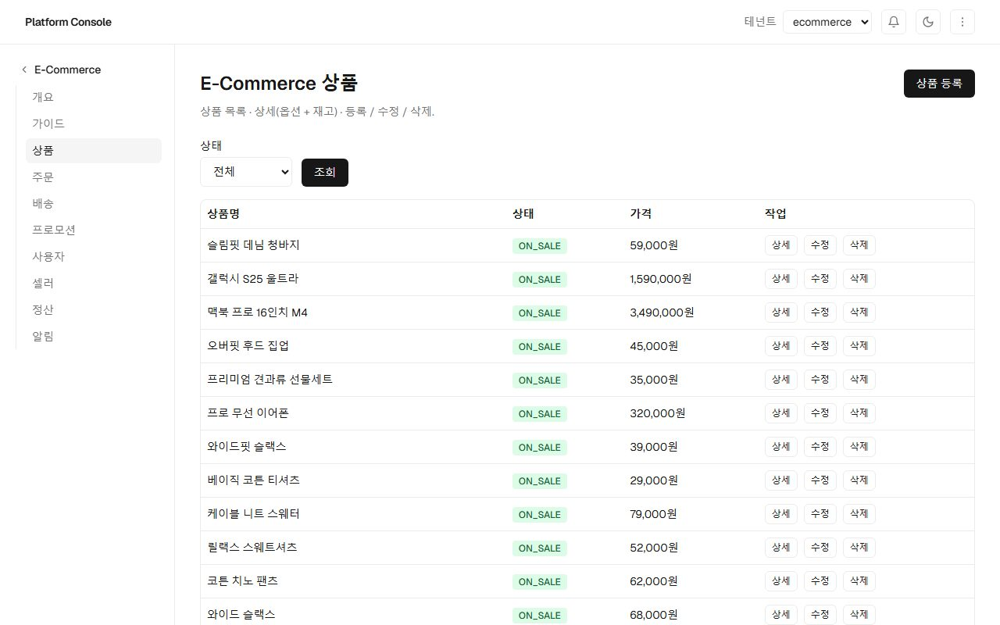
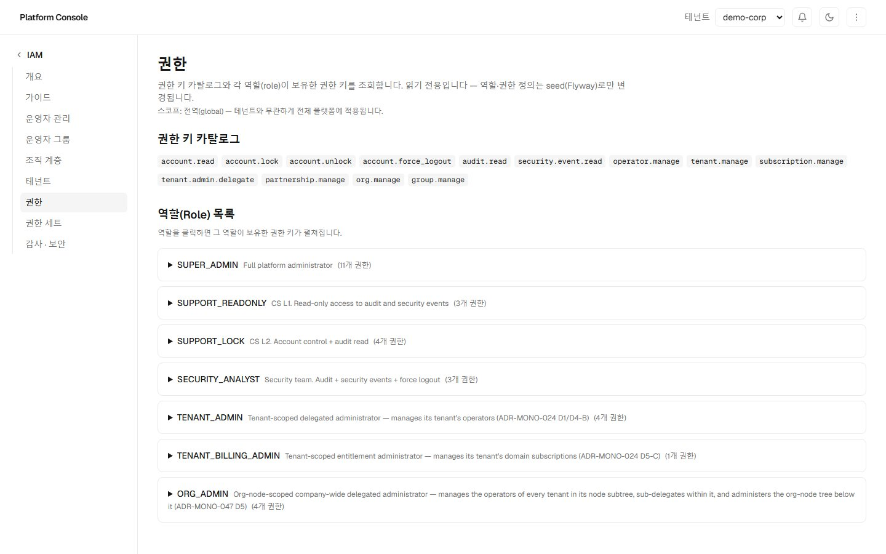
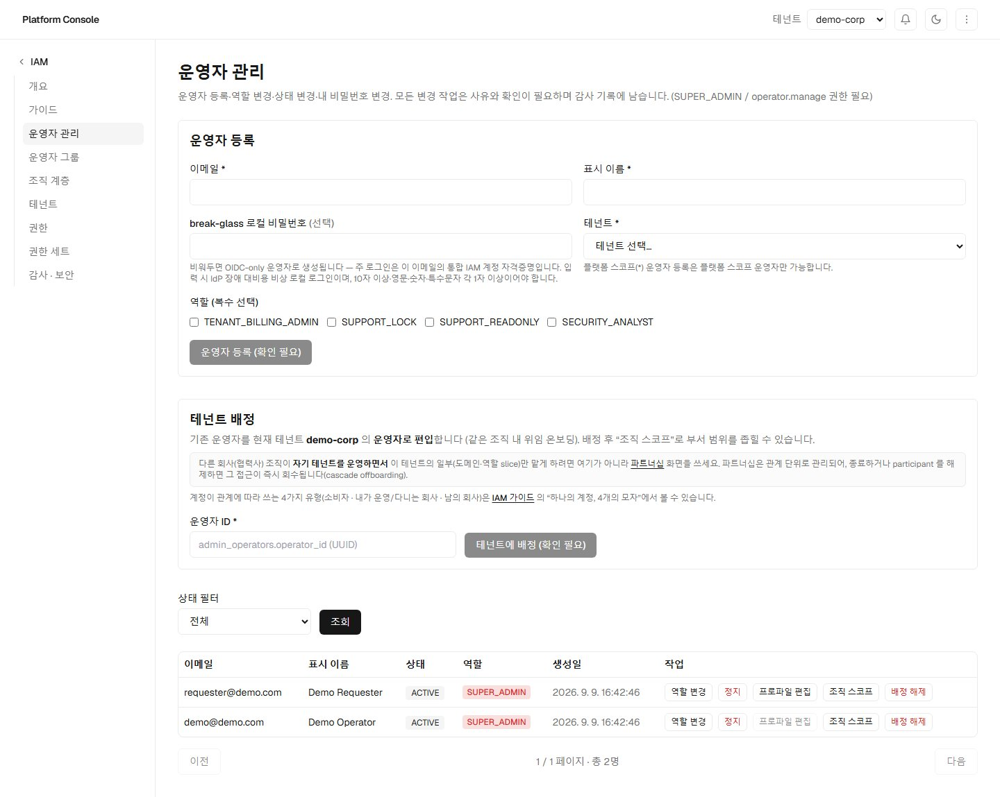

# platform-console

> 엔터프라이즈 스위트 전체를 **하나의 AWS/GCP-콘솔식 화면**으로 운영한다. 운영자는 한 번
> 로그인하고, 테넌트를 고르고, 6개 업무 도메인과 IAM 을 같은 셸 안에서 다룬다.

| 항목 | 값 |
|---|---|
| Domain | `saas` ([rules/taxonomy.md](../../rules/taxonomy.md#saas)) |
| Traits | `multi-tenant`, `integration-heavy`, `audit-heavy` |
| Service Types | `frontend-app` (`console-web`) · `rest-api` (`console-bff`) |
| IdP | IAM — OIDC **public client** (Auth Code + PKCE) · RFC 8693 token-exchange 로 테넌트 assume |
| Hostname | `console.local` (Traefik, [ADR-MONO-001](../../docs/adr/ADR-MONO-001-port-prefix-scaling.md)) · 라이브 `console.hubwang.com` |
| Status | **v1 운영 중** — `console-web` **68 페이지** · `console-bff` 가동 · CI 편입 완료 |

---

## Purpose

운영자가 **한 번 로그인하여** `ecommerce` · `wms` · `scm` · `erp` · `finance` · `iam` 을
**하나의 콘솔 안에서** 운영한다. 콘솔이 각 도메인의 gateway/admin REST API 를 호출해 화면을
그리는 **Model B (단일 UI)** 이고, 링크만 모아 둔 런처가 아니다.

🔴 **권한은 계정에 붙어 있지 않다.** 데모 계정은 각 도메인 테넌트에서 `CUSTOMER` 일 뿐이고,
운영자 역할은 **테넌트를 assume 하는 순간 파생된다**(`OperatorRoleDerivation.fromEntitledDomains`).
그래서 헤더의 테넌트 셀렉터가 장식이 아니라 **인가 경계**다 — 아래 첫 스크린샷의 헤더를 보라.

결정 근거는 [PROJECT.md](PROJECT.md) + [ADR-MONO-013](../../docs/adr/ADR-MONO-013-platform-console-foundation.md).

---

## Screenshots

> 🔵 아래 셋은 전부 **로그인 후** 화면이다 — 콘솔의 공개 표면은 둘러보기(`/demo`) 뿐이고,
> 나머지 64개 화면은 인증을 요구한다. 실서비스에서 열려면 `console.hubwang.com` 에
> 로그인한 뒤 헤더에서 테넌트를 고른다.

<p align="center">
  <br>
  <em>이커머스 상품 운영 — 콘솔이 <strong>도메인 백엔드를 직접 그린다</strong>(목업이 아니다). 헤더의 테넌트가 <code>ecommerce</code> 인 점이 핵심이다: 같은 주소를 <code>demo-corp</code> 로 열면 <strong>빈 목록</strong>이 나온다. 권한은 <code>demo-corp</code> assume 에서 파생되지만 <strong>데이터 스코프는 JWT 의 <code>tenant_id</code></strong> 를 따르기 때문이다</em>
</p>

<p align="center">
  <br>
  <em>권한 카탈로그 — 권한 키 <strong>13개</strong>와 역할 <strong>7개</strong>. 역할마다 보유 권한 수와 <strong>근거 ADR 이 화면에 적혀 있다</strong>(<code>TENANT_ADMIN … ADR-MONO-024 D1/D4-B</code> · <code>ORG_ADMIN … ADR-MONO-047 D5</code>). 읽기 전용이다 — 역할·권한 정의는 seed(Flyway)로만 바뀐다</em>
</p>

<p align="center">
  <br>
  <em>운영자 수명주기 — 등록(역할 다중선택 · <strong>break-glass 로컬 비번</strong>은 IdP 장애 대비 비상 경로다) · 테넌트 배정 · 상태 변경. 협력사가 <strong>자기 테넌트를 운영하면서</strong> 이 테넌트의 일부만 맡는 경우는 파트너십으로 가고, 관계를 끊으면 접근이 <strong>즉시 회수된다</strong>(cascade offboarding). 모든 변경은 사유를 받고 감사 기록에 남는다</em>
</p>

---

## Domain Coverage

`console-web` 의 68 페이지 중 **64개가 콘솔 셸 안**에 있다(나머지는 둘러보기 2 · 온보딩 1 · 로그인 1).

| 영역 | 화면 수 | 무엇을 하나 |
|---|---|---|
| `ecommerce` | 23 | 상품 · 주문 · 배송 · 프로모션 · 셀러 · 정산 · 알림 |
| IAM 운영 | 14 | 운영자 · 운영자 그룹 · 조직 계층 · 테넌트 · 권한 · 권한 세트 · 파트너십 · 감사 · 구독 · 계정 |
| `wms` | 7 | 입고 · 재고 · 출고 · 마스터 · 운영설정 |
| `scm` | 6 | 조달 · 재고 가시성 · 보충 계획 |
| `erp` | 6 | 마스터 5종 · 통합 조회 · 결재 · 위임 |
| `finance` | 4 | 원장(ledger) · 시산표 · 회계기간 · FX |
| `dashboards` | 3 | 도메인 헬스 · 통합 개요 |
| 셸 홈 | 1 | 도메인 진입점 |
| **합계** | **64** | |

🔵 **도메인이 안 떠 있으면 그 섹션만 「서비스 시작 필요」가 된다** — 콘솔은 도메인 없이도
뜬다. 소프트 의존이고, 그래서 방문자가 콘솔 하나만 켜 볼 수 있다.

---

## Local Dev Quick Start

```bash
# 1. 공유 Traefik 인프라 기동 (한 번만)
pnpm traefik:up

# 2. hosts 파일에 console.local 등록 (한 번만)
#    Linux/macOS: /etc/hosts
#    Windows: C:\Windows\System32\drivers\etc\hosts
echo "127.0.0.1  console.local" | sudo tee -a /etc/hosts

# 3. console-web 기동
pnpm console:up      # docker compose (Traefik join)
#   또는 로컬 dev: pnpm console:dev

# 4. 확인
curl -i http://console.local/api/health   # → {"status":"ok"}
```

🔵 **도메인 화면까지 보려면 그 도메인도 떠 있어야 한다.** 콘솔만 띄우면 셸과 IAM 화면은
열리고 업무 도메인 섹션은 「서비스 시작 필요」로 표시된다.

---

## IAM IdP Integration

콘솔은 다른 프로젝트(백엔드 Resource Server)와 달리 **OIDC public client (Auth Code + PKCE)**
로서 운영자 로그인을 수행하고, IAM 의 product/tenant 레지스트리를 카탈로그 소스로 소비한다.

로그인 뒤 한 걸음이 더 있다 — **RFC 8693 token-exchange** 로 대상 테넌트를 `audience` 에 넣어
토큰을 교환하고, 그 응답에 운영자 역할이 실린다:

```
콘솔 로그인 (platform-console-web · public client · PKCE)
  → token-exchange, audience=demo-corp
  → roles=[ECOMMERCE_OPERATOR, ERP_OPERATOR, FINANCE_OPERATOR, SCM_OPERATOR,
           WMS_OPERATOR, OUTBOUND_*, INBOUND_*, INVENTORY_*, MASTER_READ]
```

통합 계약: [specs/contracts/console-integration-contract.md](specs/contracts/console-integration-contract.md).

---

## Known Limitations

- 🔴 **다섯 화면이 참조 칸에 UUID 원문을 그린다** — 생산자가 옆 필드는 비정규화해 놓고 그
  하나만 빼놨다. 콘솔에서는 못 고친다(없는 값을 그릴 수는 없다).
  추적: `TASK-MONO-659`.
- 🔴 **일부 도메인 화면은 데모 시드가 얇아 1–3행만 나온다**(WMS 재고·출고 등). 화면의 결함이
  아니라 시드의 문제이고, 그래서 이 README 는 그 화면들을 **싣지 않았다** — 스크린샷은
  광고이므로 «꽉 찬 화면만» 건다.
- 🔵 `console-bff` 는 교차 도메인 집약을 맡는다. 도메인이 늘면 그 집약 지점도 늘어난다.

---

## References

- [PROJECT.md](PROJECT.md) — domain · traits · service map · rationale
- [tasks/INDEX.md](tasks/INDEX.md) — project task lifecycle
- [ADR-MONO-013](../../docs/adr/ADR-MONO-013-platform-console-foundation.md) — 콘솔 foundation (Model B · 배치 · BFF 계약 · 8-phase roadmap)
- `ADR-MONO-024` · `ADR-MONO-047` — 역할·위임 모델(위 권한 화면이 인용하는 그 결정들)
- [specs/contracts/console-integration-contract.md](specs/contracts/console-integration-contract.md) — 교차 프로젝트 BFF 통합 계약
